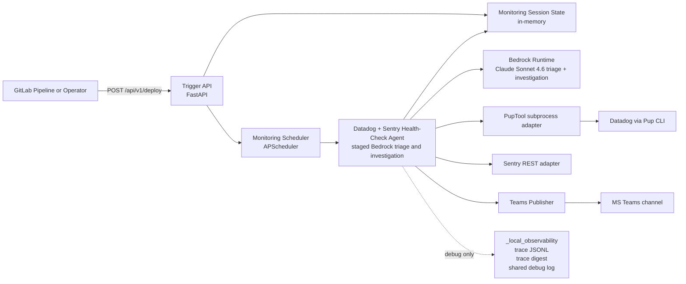
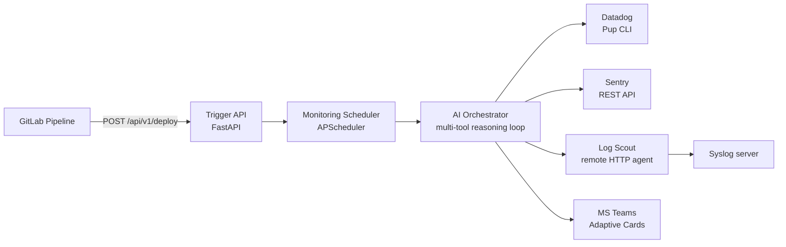

# ESS Architecture

## Overview

ESS (Eye of Sauron Service) is an agentic AI post-deploy monitoring service. It
receives deploy notifications from GitLab CI pipelines, runs periodic health
checks using Datadog, Sentry, and log search tools, and escalates findings to
MS Teams.

## Current Runtime Status

Today, the live runtime path is a staged Datadog + Sentry orchestrator that is
still narrower than the target architecture:

- Deploy triggers, scheduler-driven monitoring windows, session status APIs, and Datadog Pup integration are implemented.
- Each health-check cycle now runs a Datadog-first Bedrock triage loop and, for degraded services, a deeper Bedrock investigation loop.
- The Sentry REST adapter, Bedrock-facing Sentry tool layer, and Sentry response normalisation are implemented and participate directly in investigation turns for degraded Sentry-enabled services.
- Deterministic Datadog fallback still protects the monitoring window when the LLM path fails or returns no tool calls.
- Deterministic release-aware Sentry follow-up remains in place as a safety rail when investigation fails or does not use Sentry tools.
- The current runtime model is Claude Sonnet 4.6 for both triage and deeper investigation turns.
- Bedrock auth uses botocore's native `AWS_BEARER_TOKEN_BEDROCK` path, routed through `ESSConfig`.
- A debug-gated local trace sink records cycle execution, Bedrock requests and responses, tool actions, compaction events, notification attempts, and completion events under `_local_observability/`.
- Teams mode is config-gated and now uses richer Adaptive Cards, correlated investigation follow-up cards, and bounded webhook retries on the same runtime path.
- Log Scout is not yet wired into the live monitoring loop, and the remaining future scope is broader hardening and deployment work rather than basic notification/reporting.

This means ESS can already run repeated Datadog-backed checks for the monitoring window, deepen on degraded signals, correlate release-aware Sentry evidence inside the Bedrock investigation path, and stay observable when the model path degrades. It is still not the full three-signal architecture shown in the target view below because Log Scout remains deferred.

## Current Runtime Diagram

## Target Architecture Diagram

## Component Responsibilities

### Trigger API (FastAPI)
- Receives `POST /api/v1/deploy` from GitLab pipelines
- Validates multi-service deploy payloads via pydantic
- Returns `202 Accepted` with job ID and schedule details
- Exposes `/health` and `/api/v1/status` endpoints

### Job Scheduler (APScheduler)
- Creates interval jobs on deploy trigger (every N minutes)
- Auto-removes jobs after monitoring window expires
- Supports cancellation via `DELETE /api/v1/deploy/{job_id}`
- In-memory job store (v1), Redis persistence (future)

### AI Orchestrator (ReAct Loop)
- Current runtime path: staged Datadog-first Bedrock triage followed by deeper Bedrock investigation for degraded services, with deterministic fallback and deterministic Sentry safety rails preserved
- Target path: expand the same loop to include Log Scout and richer downstream reporting without replacing the current orchestrator seam
- Current runtime model: Sonnet 4.6 for both triage and deeper investigation turns
- Future cost/performance tuning may reintroduce a cheaper triage model once the expanded runtime is fully validated
- Runs health checks across all services in the deploy trigger
- Escalates to deeper investigation when anomalies are detected
- Manages context-window pressure with summarisation compaction during longer tool runs

### Tool Layer
- **Datadog (Pup CLI)**: async subprocess, monitors/logs/APM/incidents/infra
- **Sentry (REST API)**: aiohttp client, issues/details/traces, Bedrock tool schemas, pydantic response validation, bounded retries, semaphore, and circuit breaker
- **Log Scout (HTTP)**: remote agent on syslog servers, ripgrep search
- All tools normalised to `ToolResult` dataclass

### Notification (MS Teams)
- Incoming webhook with Adaptive Cards
- Rich issue, investigation-follow-up, and monitoring-summary card content on the current runtime path
- Current transport: Teams incoming webhook with correlated follow-up cards on the same channel path
- Retry with exponential backoff for retryable webhook failures
- Current notification policy: immediate `CRITICAL`, second consecutive `WARNING`, investigation follow-up after a delivered alert when deeper evidence exists, end-of-window summary

## Data Flow

1. GitLab pipeline completes → `POST /deploy` with services array
2. Scheduler creates interval job for the monitoring window
3. Each tick starts a Datadog-first Bedrock triage loop against Pup-backed Datadog tools
4. If triage is healthy, the cycle ends with a Datadog-backed summary and no Sentry work
5. If triage is degraded for a service, the agent starts a deeper investigation loop for that service and enables Sentry tools when the deploy context supports them
6. If the investigation path fails or omits Sentry evidence for a degraded Sentry-enabled service, deterministic release-aware Sentry follow-up still runs as a safety rail
7. If the Bedrock path fails or returns no tool calls, deterministic Datadog triage still runs for the cycle
8. When debug tracing is enabled, the agent writes structured JSONL events, a Markdown digest, and structured debug logs under `_local_observability/`, including conversation-compaction events when token pressure forces summarisation
9. Findings are stored in the in-memory monitoring session and exposed by the session API
10. End of window: the job is removed and summary delivery runs through the same instrumentation seam as cycle notifications

## Key Design Decisions

- **Observer only**: ESS never takes remediation actions
- **Multi-service triggers**: one deploy can monitor multiple services
- **Per-service tool config**: each service carries its own DD/Sentry/log config
- **Circuit breakers**: tool adapters disable after 3 consecutive failures
- **Bedrock bearer token**: native botocore bearer-token auth via `AWS_BEARER_TOKEN_BEDROCK`, routed through `ESSConfig`

## Related Documentation

- [Configuration](CONFIGURATION.md) — env vars and config loader
- [Workflows](WORKFLOWS.md) — detailed flow descriptions
- [Technology Decisions](../designs/technology-decisions.md) — tool selection rationale
