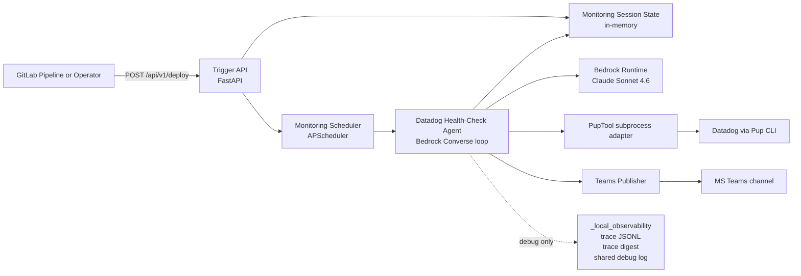
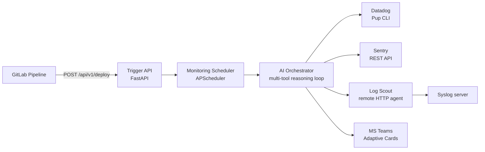

# ESS Architecture

## Overview

ESS (Eye of Sauron Service) is an agentic AI post-deploy monitoring service. It
receives deploy notifications from GitLab CI pipelines, runs periodic health
checks using Datadog, Sentry, and log search tools, and escalates findings to
MS Teams.

## Current Runtime Status

Today, the live runtime path is narrower than the target architecture:

- Deploy triggers, scheduler-driven monitoring windows, session status APIs, and Datadog Pup integration are implemented.
- The health-check path uses a Datadog-only Bedrock tool-calling loop with deterministic Pup fallback when the LLM path fails or produces no tool calls.
- The current runtime model is Claude Sonnet 4.6 for both triage and deeper investigation turns.
- Bedrock auth uses botocore's native `AWS_BEARER_TOKEN_BEDROCK` path, routed through `ESSConfig`.
- A debug-gated local trace sink records the observable agent execution path for each monitoring cycle under `_local_observability/`.
- Teams mode is config-gated and uses the same runtime path for repeated-warning, critical, and end-of-window notifications.
- Sentry and Log Scout are not yet wired into the live monitoring loop.

This means ESS can already run repeated Datadog-backed checks for the monitoring window, but it is not yet the full multi-tool, notification-complete architecture shown in the target view below.

## Current Runtime Diagram

## Target Architecture Diagram

## Component Responsibilities

### Trigger API (FastAPI)
- Receives `POST /api/v1/deploy` from GitLab pipelines
- Validates multi-service deploy payloads via pydantic
- Returns `202 Accepted` with job ID and schedule details
- Exposes `/health` and `/api/v1/status` endpoints

### Job Scheduler (APScheduler)
- Creates interval jobs on deploy trigger (every N minutes)
- Auto-removes jobs after monitoring window expires
- Supports cancellation via `DELETE /api/v1/deploy/{job_id}`
- In-memory job store (v1), Redis persistence (future)

### AI Orchestrator (ReAct Loop)
- Current runtime path: Datadog-only Bedrock tool loop plus deterministic fallback
- Target path: full LLM-driven reasoning loop using AWS Bedrock converse API
- Current runtime model: Sonnet 4.6 for both triage and deeper investigation turns
- Future cost/performance tuning may reintroduce a cheaper triage model once the first deliverable is fully validated
- Runs health checks across all services in the deploy trigger
- Escalates to deeper investigation when anomalies detected
- Context-window management with summarisation compaction

### Tool Layer
- **Datadog (Pup CLI)**: async subprocess, monitors/logs/APM/incidents/infra
- **Sentry (REST API)**: aiohttp client, issues/details/traces
- **Log Scout (HTTP)**: remote agent on syslog servers, ripgrep search
- All tools normalised to `ToolResult` dataclass

### Notification (MS Teams)
- Incoming webhook with Adaptive Cards
- Three card types: all-clear, issue-detected, monitoring-summary
- Retry with exponential backoff
- Current runtime path: bounded async webhook POSTs with explicit timeout, no retry yet
- Phase 1.5 policy: immediate `CRITICAL`, second consecutive `WARNING`, end-of-window summary

## Data Flow

1. GitLab pipeline completes → `POST /deploy` with services array
2. Scheduler creates interval job for the monitoring window
3. Each tick: the Datadog agent loop runs Bedrock tool-calling against Pup-backed Datadog tools
4. If triage signals require more evidence, the same cycle can issue a second or third Bedrock turn for Datadog investigation tools
5. If the LLM path fails or returns no tool calls, deterministic Datadog triage still runs
6. When debug tracing is enabled, the agent writes structured JSONL events, a Markdown digest, and structured debug logs under `_local_observability/`
7. Findings are stored in the in-memory monitoring session and exposed by the session API
8. End of window: the job is removed and summary delivery runs through the same instrumentation seam as cycle notifications

## Key Design Decisions

- **Observer only**: ESS never takes remediation actions
- **Multi-service triggers**: one deploy can monitor multiple services
- **Per-service tool config**: each service carries its own DD/Sentry/log config
- **Circuit breakers**: tool adapters disable after 3 consecutive failures
- **Bedrock bearer token**: native botocore bearer-token auth via `AWS_BEARER_TOKEN_BEDROCK`, routed through `ESSConfig`

## Related Documentation

- [Configuration](CONFIGURATION.md) — env vars and config loader
- [Workflows](WORKFLOWS.md) — detailed flow descriptions
- [Technology Decisions](../designs/technology-decisions.md) — tool selection rationale
