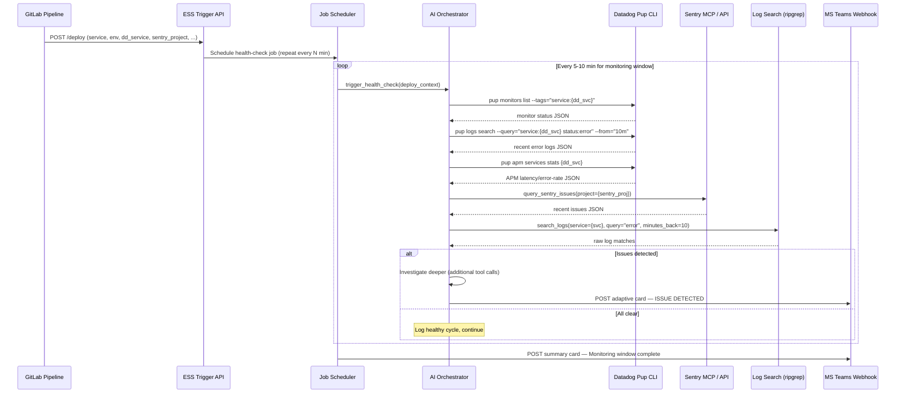
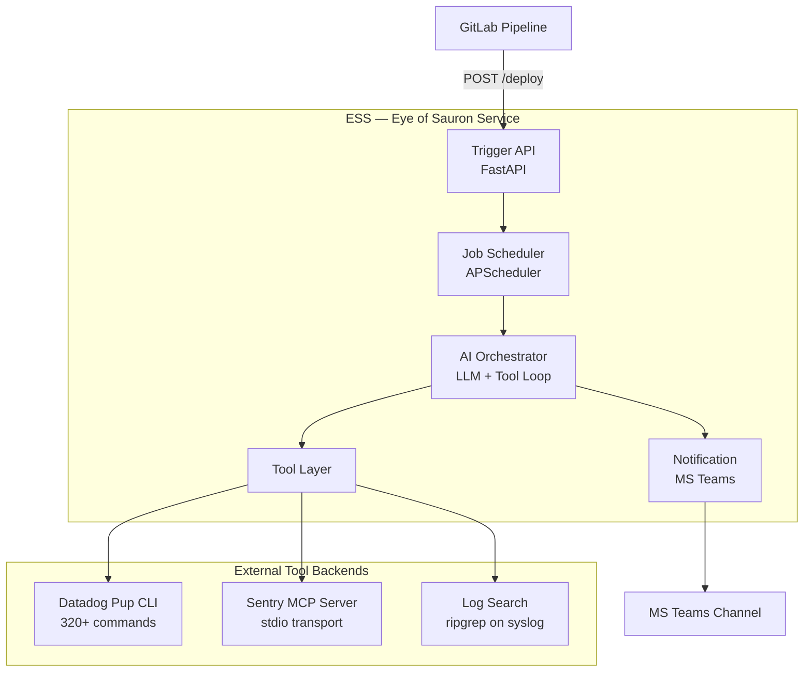

# ESS — Eye of Sauron Service

> *"One service to watch them all, one service to find them,
> one service to alert them all, and in the Teams channel bind them."*

## Deliverable Plans

This master plan is broken into three implementable deliverables:

1. **[Datadog Pup CLI Integration](ess-datadog-pup-integration.md)** — PupTool adapter, health-check and investigation methods, Bedrock tool schemas, Docker install, circuit breaker (25-35h)
2. **[Sentry Integration](../backlog/ess-sentry-integration.md)** — REST API client (ported from log-ai), issue/trace queries, 429 backoff, future MCP upgrade path (20-30h)
3. **[Log Scout: Syslog Search Agent](../backlog/ess-log-scout-syslog-agent.md)** — Standalone HTTP microservice on syslog servers, ripgrep search, ESS client adapter, per-host routing (30-40h)

The **foundation** (Phase 1: trigger API, scheduler, config, Bedrock auth) and **orchestration** (Phase 3: ReAct loop, escalation, context management) remain in this master plan as they span all three tool verticals.

---

## High-Level Architecture





## Executive Summary

ESS is an agentic AI service that monitors production deployments in real time.
When a GitLab pipeline completes a successful production deploy, it fires an HTTP
request to ESS with full service context. ESS then runs periodic health checks
using Datadog, Sentry, and raw log search tools — all orchestrated by an LLM
reasoning loop — and escalates to MS Teams when issues are detected.

The key insight is that ESS does **not** remediate. It watches, investigates, and
reports. The agent's job is to correlate signals across observability platforms,
understand what went wrong post-deploy, and present a clear, actionable summary
to the engineering team.

---

## Problem Statement

Today, production deploy verification is manual and reactive:
- Engineers deploy and check Datadog dashboards by hand
- Sentry issues may go unnoticed until a customer reports them
- Correlating APM latency spikes, new Sentry errors, and log anomalies requires
  switching between multiple tools and holding context in your head
- There is no systematic post-deploy watch window with escalation

ESS solves this by automating the "experienced SRE watching after a deploy"
pattern with an AI agent that has direct tool access to all observability
platforms.

---

## Technology Evaluation & Decisions

### Decision 1: Datadog Integration — Pup CLI vs. Manual API Client

| Concern | Manual API Client (current log-ai) | Datadog Pup CLI | Recommendation |
|---|---|---|---|
| **Coverage** | 6 hand-built tools (APM, logs, metrics, monitors, events, deps) | 320+ commands across 49 domains | **Pup** |
| **Maintenance** | We own all API format changes, auth handling, pagination | Maintained by Datadog Labs, tracks API client library | **Pup** |
| **Token efficiency** | Returns raw API JSON, agent must parse | Agent-mode returns structured JSON with metadata and hints | **Pup** |
| **Auth** | DD_API_KEY + DD_APP_KEY, manual scope management | OAuth2+PKCE preferred, API key fallback, automatic agent detection | **Pup** |
| **APM** | Manually built SpansListRequest (caused 400s in production) | `pup apm services list/stats/operations/resources` — tested, working | **Pup** |
| **Monitors** | Basic list via datadog-api-client | `pup monitors list/get/search` with tag filtering | **Pup** |
| **Logs** | Manually built LogsListRequest (caused 400s in production) | `pup logs search --query="..." --from="10m"` — proven working | **Pup** |
| **Incidents** | Not implemented | Full incident lifecycle (list, get, attachments, settings) | **Pup** |
| **CI/CD** | Backlog plan only | `pup cicd pipelines/events/tests/dora/flaky-tests` — working | **Pup** |
| **Infrastructure** | `psutil`-based local monitoring | `pup infrastructure hosts list/get` across fleet | **Pup** |
| **Install** | Python pip deps (ddtrace, datadog, datadog-api-client) | Single binary, Homebrew, or cargo build | **Pup** |
| **Self-hosted risk** | We own the code | Open source, Apache-2.0, 489 stars, active (v0.33.0, 32 releases) | **Acceptable** |

**Verdict: Use Datadog Pup CLI.**

The current log-ai Datadog integration required extensive manual API client work
that resulted in production 400/403 errors. Pup wraps the same APIs in a tested,
maintained CLI with structured agent-friendly output. It eliminates the entire
class of API format headaches and gives ESS access to 50x more Datadog surface
area (incidents, CI/CD, synthetics, SLOs, etc.) with zero custom code.

**Integration approach**: ESS calls `pup` as a subprocess with
`asyncio.create_subprocess_exec()`, parsing structured JSON output. Environment
variables (`DD_API_KEY`, `DD_APP_KEY`, `DD_SITE`) or OAuth2 login handle auth.
The `--agent` flag or `FORCE_AGENT_MODE=1` ensures machine-optimised responses.

---

### Decision 2: Sentry Integration — Sentry MCP Server vs. Custom API Client vs. Port log-ai

| Concern | Log-ai Custom Client | Sentry MCP Server (`@sentry/mcp-server`) | Recommendation |
|---|---|---|---|
| **Coverage** | 3 tools (query_issues, issue_details, search_traces) | Full Sentry API: issues, traces, events, AI-powered search, Seer | **Sentry MCP** |
| **Self-hosted** | Works with `sentry_url` config | `--host=sentry.example.com` flag, stdio transport | **Both work** |
| **Maintenance** | We own parsing, pagination, error mapping | Maintained by Sentry (getsentry), 606 stars, 41 contributors | **Sentry MCP** |
| **AI features** | None | `search_events`, `search_issues` — LLM-powered natural language query translation | **Sentry MCP** |
| **Auth** | `SENTRY_AUTH_TOKEN` in config | `SENTRY_ACCESS_TOKEN` env var + optional LLM provider for AI search | **Both** |
| **Token efficiency** | Raw API JSON | Optimised MCP responses designed for agent consumption | **Sentry MCP** |
| **Integration model** | Python function calls | stdio MCP server (npx), or direct HTTP to mcp.sentry.dev | **Sentry MCP** |
| **Maturity** | Stable but limited | Production tag, active development (last commit 3 days ago) | **Sentry MCP** |

**Verdict: Use Sentry MCP server for primary integration.**

ESS should invoke the Sentry MCP server via stdio transport (`npx @sentry/mcp-server
--access-token=TOKEN --host=sentry.example.com`) for self-hosted instances. This
gives us maintained, agent-optimised Sentry access without owning the API client.

For scenarios where the MCP server cannot be used (air-gapped environments, or if
npx is unavailable), the log-ai Sentry integration code serves as a proven
fallback that can be ported with minimal changes.

**Integration approach**: ESS runs `@sentry/mcp-server` as a stdio subprocess and
communicates via JSON-RPC MCP protocol, or alternatively wraps key Sentry REST API
calls directly (porting the 3 existing log-ai tools) for simpler deployment.

A pragmatic hybrid is recommended for Phase 2:
1. **Primary path**: Direct Sentry REST API calls (port/reference log-ai's
   `sentry_integration.py`) — simpler, no Node.js dependency, proven working for
   the 3 core queries ESS needs (issues, issue details, traces).
2. **Future upgrade**: Once ESS is stable, evaluate migrating to Sentry MCP stdio
   transport for AI-powered search and broader coverage.

---

### Decision 3: Log Search — Local Agent on Syslog Server

| Concern | Port to ESS directly | Call log-ai MCP over SSH | Local log agent (new) | Recommendation |
|---|---|---|---|---|
| **Network traffic** | ESS must be on syslog box or mount logs via NFS | SSH per search, latency | Agent local to syslog, zero network for search | **Local agent** |
| **Coupling** | ESS owns search code | Depends on log-ai process | Thin agent, ESS orchestrates | **Local agent** |
| **Complexity** | Full ripgrep + service resolution in ESS | MCP JSON-RPC over SSH | Small HTTP/MCP service, minimal logic | **Local agent** |
| **Scalability** | ESS tied to one syslog server | One SSH session per search | Agent handles local I/O, ESS stays stateless | **Local agent** |
| **Reuse** | Duplicates log-ai code | Reuses log-ai directly | New lightweight service, shares log-ai patterns | **Local agent** |

**Verdict: Deploy a lightweight local log-search agent on the syslog server.**

ESS should NOT run on the syslog server or mount remote log volumes. Instead, a
small local agent ("ESS Log Scout") runs on the syslog server and exposes a
minimal HTTP API or MCP stdio endpoint that ESS calls remotely. This approach:

1. **Avoids network traffic for log data** — ripgrep runs locally, only results
   are sent back to ESS over the wire.
2. **Keeps ESS stateless and portable** — ESS can run anywhere (k8s, ECS, etc.)
   without filesystem access to logs.
3. **Reuses proven patterns** — the log scout is derived from log-ai's search
   implementation (ripgrep subprocess, `services.yaml` resolution, UTC handling)
   but packaged as a standalone microservice instead of an MCP server.
4. **Supports multiple syslog servers** — ESS can call different log scouts for
   different regions or environments.

**Integration approach**: ESS calls the log scout via HTTP (`POST /search`) with
service name, query, and time range. The scout returns matched log entries as
JSON. A separate plan should be created for the log scout service itself.

> **Future plan needed**: "ESS Log Scout — Lightweight Log Search Agent" covering
> the scout's API design, deployment on syslog servers, auth, and how it relates
> to the existing log-ai MCP server (which can continue serving interactive agent
> use cases independently).

---

### Decision 4: Agentic AI Framework — Build vs. Framework

| Concern | Custom tool loop | LangGraph | CrewAI | OpenAI Agents SDK | Recommendation |
|---|---|---|---|---|---|
| **Control** | Full | Medium | Low | Medium | Custom or LangGraph |
| **Complexity** | Low-medium | Medium | High | Medium | Custom |
| **Dependencies** | Just LLM SDK | langchain ecosystem | crewai + deps | openai SDK | Custom = minimal |
| **Observability** | Roll your own | LangSmith | CrewAI dashboard | OpenAI traces | Datadog Pup covers this |
| **LLM flexibility** | Any provider | Any via langchain | Any via litellm | OpenAI only | Custom or LangGraph |
| **Token management** | Manual | Built-in | Built-in | Built-in | Manual is fine |
| **Maturity** | Proven pattern | Mature | Maturing | Newer | Custom or LangGraph |

**Verdict: Start with a custom tool-calling loop; evaluate LangGraph for Phase 3+.**

ESS's orchestration pattern is straightforward:
1. Receive deploy context
2. Run a fixed set of health-check tool calls
3. If anomalies detected, reason about them and run deeper investigation calls
4. Summarise and publish

This is a classic ReAct loop that does not require a heavyweight framework. A
custom implementation using direct LLM API calls (Claude via AWS Bedrock or
Anthropic API, with OpenAI as fallback) keeps the dependency footprint minimal
and the behaviour fully transparent.

If the agent's reasoning needs become more complex (multi-step investigation
graphs, parallel investigation branches, human-in-the-loop escalation), LangGraph
is the natural upgrade path because it models agent workflows as explicit state
machines.

**Recommended LLM**:
- **Triage cycles**: Claude Haiku 4.5 via AWS Bedrock — fast, cheap, sufficient
  for standard health-check tool calls and yes/no anomaly detection.
- **Investigation cycles**: Claude Sonnet 4.6 (`global.anthropic.claude-sonnet-4-6`)
  via AWS Bedrock — deeper reasoning for root-cause analysis and correlation.
- **Fallback**: OpenAI GPT-4.1-mini if Bedrock is unavailable.

**Bedrock auth**: Bearer token format (`ABSK<Base64(key_id:secret)>`) decoded
into standard AWS credentials at startup, consistent with the Vellum/Wellspring
stack. See Decision 8 (Bedrock Auth) below.

---

### Decision 5: HTTP Framework for Trigger API

| Concern | FastAPI | Flask | Hono (Python) | Recommendation |
|---|---|---|---|---|
| **Async native** | Yes (ASGI) | No (WSGI) | N/A | **FastAPI** |
| **Validation** | Pydantic built-in | Manual | N/A | **FastAPI** |
| **Ecosystem** | Mature, large | Mature, large | N/A | **FastAPI** |
| **Performance** | Excellent (uvicorn) | Good | N/A | **FastAPI** |
| **Fit with ESS** | Pydantic models, async handlers, OpenAPI docs | Would need async bolt-ons | N/A | **FastAPI** |

**Verdict: FastAPI.** It's async-native, uses Pydantic for request validation (matching
log-ai's config conventions), auto-generates OpenAPI docs for the trigger
endpoint, and runs on uvicorn for production.

---

### Decision 6: Job Scheduler

| Concern | APScheduler | Celery + Beat | Custom asyncio | Recommendation |
|---|---|---|---|---|
| **Complexity** | Low | High (requires broker) | Very low | **APScheduler** |
| **Persistence** | Optional (SQLite, Redis) | Redis/RabbitMQ required | None | **APScheduler** |
| **Dynamic jobs** | Yes — add/remove at runtime | Yes but complex | Manual | **APScheduler** |
| **Async support** | Yes (AsyncIOScheduler) | Yes via async worker | Native | **APScheduler** |
| **Fit** | Perfect for "run every N minutes for M minutes" | Overkill for ESS v1 | Too basic | **APScheduler** |

**Verdict: APScheduler (AsyncIOScheduler).** Each deploy trigger creates a
recurring job that runs every N minutes for the monitoring window, then
self-removes. APScheduler handles this natively with minimal configuration.

---

### Decision 7: MS Teams Notification

| Concern | Incoming Webhook (Adaptive Cards) | MS Graph API | Power Automate | Recommendation |
|---|---|---|---|---|
| **Setup** | Channel webhook URL, no app registration | App registration, OAuth | Flow creation | **Webhook** |
| **Capabilities** | Rich adaptive cards, images, actions | Full Teams API | Full but slow | **Webhook** |
| **Auth** | Webhook URL is the secret | OAuth2 client credentials | Microsoft account | **Webhook** |
| **Complexity** | POST JSON to URL | Token management, scopes | No-code but brittle | **Webhook** |

**Verdict: MS Teams Incoming Webhook with Adaptive Cards.** Simplest integration,
supports rich formatting for health reports, requires only a webhook URL.

---

### Decision 8: Bedrock Authentication — Bearer Token

ESS uses the same bearer-token auth pattern established in the Vellum and
Wellspring stacks:

```python
# config/.env
AWS_BEARER_TOKEN_BEDROCK=ABSK<Base64(key_id:secret)>
AWS_BEDROCK_REGION=us-west-2
AWS_EC2_METADATA_DISABLED=true
```

At startup, the config loader:
1. Strips the `ABSK` prefix from `AWS_BEARER_TOKEN_BEDROCK`
2. Base64-decodes the payload to `key_id:secret`
3. Splits on `:` into `AWS_ACCESS_KEY_ID` and `AWS_SECRET_ACCESS_KEY`
4. Syncs both to `os.environ` for boto3 consumption
5. Disables IMDS (`AWS_EC2_METADATA_DISABLED=true`) to prevent local dev timeouts

The boto3 `bedrock-runtime` client then uses standard AWS credential chain:
```python
import boto3
client = boto3.client(
    service_name="bedrock-runtime",
    region_name=config.aws_bedrock_region,
    # Credentials picked up from os.environ automatically
)
response = client.converse(
    modelId="global.anthropic.claude-sonnet-4-6",
    messages=[...],
    toolConfig={...},
)
```

This avoids storing raw AWS key/secret pairs in config files — the ABSK token is
the single credential to manage.

---

## Detailed Phase Design

### Phase 1 — Foundation & Trigger API

**Goal**: A running service that accepts deploy-trigger HTTP requests from GitLab
pipelines and schedules timed health-check jobs.

#### E1.1 — Scaffold ESS repo and Python project structure

Create the project with uv, following log-ai conventions:

```
ess/
├── pyproject.toml
├── AGENTS.md
├── README.md
├── config/
│   ├── .env.example
│   └── services.yaml          # shared format with log-ai
├── src/
│   ├── __init__.py
│   ├── main.py                # FastAPI app entry point
│   ├── config.py              # pydantic-settings config loader
│   ├── models.py              # deploy event schema, health check models
│   ├── scheduler.py           # APScheduler job management
│   ├── llm_client.py          # Bedrock converse client (bearer token auth)
│   ├── tools/                 # tool adapters (Phase 2)
│   ├── agent/                 # AI orchestrator (Phase 3)
│   └── notifications/         # MS Teams publisher (Phase 4)
├── tests/
├── docs/
│   ├── INDEX.md
│   └── plans/
└── .agents/skills/            # mirrored from log-ai
```

#### E1.2 — Implement HTTP trigger endpoint

A single deploy trigger can contain **multiple services** (e.g., a main service
plus a scheduler sidecar). Each service in the `services` array has its own
Datadog, Sentry, and log-search config because services may run on different
infrastructure (K8s vs. ECS Fargate) with different naming conventions.

```python
# POST /api/v1/deploy
{
    "deployment": {
        "gitlab_pipeline_id": "12345",
        "gitlab_project": "group/repo",
        "commit_sha": "abc123def",
        "deployed_by": "jane.doe",
        "deployed_at": "2026-03-22T14:30:00Z",
        "environment": "production",
        "regions": ["ca", "us"]              # one trigger, multiple regions
    },
    "services": [
        {
            "name": "hub-ca-auth",                    # log service name
            "datadog_service_name": "example-auth-service",
            "sentry_project": "auth-service",
            "sentry_dsn": "https://...",              # optional
            "infrastructure": "k8s",                   # k8s | ecs-fargate
            "log_search_host": "syslog-ca.example.com" # which log scout to call
        },
        {
            "name": "hub-ca-auth-scheduler",           # sidecar scheduler
            "datadog_service_name": "example-auth-scheduler",
            "sentry_project": "auth-scheduler",
            "infrastructure": "ecs-fargate",
            "log_search_host": "syslog-ca.example.com"
        }
    ],
    "monitoring": {
        "window_minutes": 30,                # how long to watch (default: 30)
        "check_interval_minutes": 5,         # how often to check (default: 5)
        "teams_webhook_url": "https://..."   # where to post alerts
    },
    "extra_context": {}                      # arbitrary metadata
}
```

Response: `202 Accepted` with:
```json
{
    "job_id": "ess-abc123",
    "status": "scheduled",
    "services_monitored": 2,
    "checks_planned": 6,
    "regions": ["ca", "us"]
}
```

For each health-check cycle, ESS runs triage across **all services** in the
trigger. If one service shows anomalies, investigation focuses on that service
independently. The final report aggregates per-service findings.

#### E1.3 — Define deploy-event schema

Pydantic v2 models with validation:
- `deployment`: required block with `environment`, `gitlab_pipeline_id`, `commit_sha`
- `services`: list of 1+ `ServiceTarget` models, each requiring `name` and `datadog_service_name`
- `monitoring`: optional block with defaults (`window_minutes=30`, `check_interval_minutes=5`)
- `regions`: list of region codes (e.g., `["ca", "us"]`)
- Validate `environment` is one of known values
- Validate `teams_webhook_url` is a valid HTTPS URL when provided
- Validate at least one service in the `services` array

#### E1.4 — Implement job scheduler

APScheduler `AsyncIOScheduler`:
- On deploy trigger: create an interval job (every `check_interval_minutes`)
- Job runs `health_check(deploy_context)` on each tick
- After `monitoring_window_minutes`, auto-remove the job and post summary
- Support cancellation via `DELETE /api/v1/deploy/{job_id}`
- Store active jobs in memory (v1) with Redis persistence (v2)

#### E1.5 — Configuration layer

Pydantic-settings config matching log-ai conventions:

```python
class ESSConfig(BaseSettings):
    model_config = SettingsConfigDict(env_file="config/.env")

    # LLM — Bedrock with bearer token auth
    llm_provider: str = "bedrock"         # bedrock | anthropic | openai
    triage_model: str = "global.anthropic.claude-haiku-4-5"      # fast, cheap
    investigation_model: str = "global.anthropic.claude-sonnet-4-6"  # deep reasoning
    aws_bedrock_region: str = "us-west-2"
    aws_bearer_token_bedrock: str = ""    # ABSK<Base64(key_id:secret)>
    aws_ec2_metadata_disabled: bool = True

    # Datadog (for Pup CLI)
    dd_api_key: str
    dd_app_key: str
    dd_site: str = "datadoghq.com"

    # Sentry
    sentry_auth_token: str
    sentry_host: str = "sentry.example.com"
    sentry_org: str = "example"

    # Log scout (local agent on syslog servers)
    default_log_scout_url: str = "http://syslog.example.com:8090"

    # Defaults
    default_monitoring_window_minutes: int = 30
    default_check_interval_minutes: int = 5
    max_monitoring_window_minutes: int = 120

    # MS Teams
    default_teams_webhook_url: Optional[str] = None

    def model_post_init(self, __context) -> None:
        """Decode ABSK bearer token into AWS credentials for boto3."""
        import os, base64
        token = self.aws_bearer_token_bedrock
        if token:
            payload = token[4:] if token.startswith("ABSK") else token
            try:
                decoded = base64.b64decode(payload).decode("utf-8")
                if ":" in decoded:
                    key_id, secret = decoded.split(":", 1)
                    os.environ["AWS_ACCESS_KEY_ID"] = key_id
                    os.environ["AWS_SECRET_ACCESS_KEY"] = secret.strip()
            except Exception:
                pass  # Will fail at Bedrock call time
        if self.aws_bedrock_region:
            os.environ["AWS_DEFAULT_REGION"] = self.aws_bedrock_region
        if self.aws_ec2_metadata_disabled:
            os.environ["AWS_EC2_METADATA_DISABLED"] = "true"
```

#### E1.6 — Tests

- Trigger endpoint validation (valid/invalid payloads)
- Scheduler job creation, execution counting, auto-cleanup
- Config loading with missing/invalid values

#### E1.7 — Documentation

- README with project overview and quickstart
- AGENTS.md adapted from log-ai template
- docs/INDEX.md with plan tracking

---

### Phase 2 — Tool Integration Layer

**Goal**: ESS can execute Datadog, Sentry, and log-search queries and normalise
results into a format the AI orchestrator can consume.

#### E2.1 — Datadog Pup CLI adapter

```python
class PupTool:
    """Execute Datadog Pup CLI commands as async subprocesses."""

    async def execute(self, args: list[str], timeout: int = 60) -> dict:
        """Run `pup <args>` and return parsed JSON."""
        env = {
            "DD_API_KEY": self.config.dd_api_key,
            "DD_APP_KEY": self.config.dd_app_key,
            "DD_SITE": self.config.dd_site,
            "FORCE_AGENT_MODE": "1",
        }
        proc = await asyncio.create_subprocess_exec(
            "pup", *args, "--output", "json",
            stdout=PIPE, stderr=PIPE, env={**os.environ, **env}
        )
        stdout, stderr = await asyncio.wait_for(
            proc.communicate(), timeout=timeout
        )
        return json.loads(stdout)

    # Convenience methods
    async def get_monitor_status(self, service: str, env: str) -> dict:
        return await self.execute([
            "monitors", "list",
            f'--tags=service:{service},env:{env}'
        ])

    async def search_error_logs(self, service: str, minutes: int) -> dict:
        return await self.execute([
            "logs", "search",
            f'--query=service:{service} status:error',
            f'--from={minutes}m'
        ])

    async def get_apm_stats(self, service: str, env: str) -> dict:
        return await self.execute([
            "apm", "services", "stats", service,
            f"--env={env}"
        ])

    async def get_recent_incidents(self) -> dict:
        return await self.execute(["incidents", "list"])

    async def get_infrastructure_health(self, service: str) -> dict:
        return await self.execute([
            "infrastructure", "hosts", "list",
            f'--filter=service:{service}'
        ])
```

ESS installs Pup via Homebrew in the container (`brew install datadog-labs/pack/pup`)
or includes the pre-built binary in the Docker image.

#### E2.2 — Sentry adapter

Primary approach — direct REST API calls (ported from log-ai):

```python
class SentryTool:
    """Query Sentry REST API for issues and traces."""

    async def query_issues(self, project: str, query: str = "is:unresolved",
                           hours_back: int = 1) -> dict: ...

    async def get_issue_details(self, issue_id: str) -> dict: ...

    async def search_traces(self, project: str, query: str) -> dict: ...
```

Future upgrade path: replace with Sentry MCP stdio transport when ESS requires
AI-powered search or broader Sentry coverage.

#### E2.3 — Log scout adapter (remote log search)

ESS calls the ESS Log Scout agent running on the syslog server via HTTP:

```python
class LogScoutTool:
    """Call the remote ESS Log Scout agent for log search."""

    async def search(self, service: str, query: str,
                     minutes_back: int = 10,
                     log_scout_url: str | None = None) -> dict:
        """POST to the log scout and return matched entries."""
        url = log_scout_url or self.config.default_log_scout_url
        async with aiohttp.ClientSession() as session:
            resp = await session.post(
                f"{url}/search",
                json={
                    "service": service,
                    "query": query,
                    "minutes_back": minutes_back,
                },
                timeout=aiohttp.ClientTimeout(total=120),
            )
            return await resp.json()
```

The log scout runs on the syslog server, handles ripgrep execution and
`services.yaml` resolution locally, and returns only matched log entries over the
wire. Each service in a deploy trigger can specify a different `log_search_host`
so ESS can query region-specific syslog servers.

> **Note**: The ESS Log Scout is a separate service with its own plan. It shares
> patterns from log-ai but is packaged as a minimal HTTP microservice, not an MCP
> server.

#### E2.4 — Unified tool-result normalisation

All tool adapters return a common shape:

```python
@dataclass
class ToolResult:
    tool: str           # "datadog.monitors", "sentry.issues", "logs.search"
    success: bool
    data: dict | list   # normalised payload
    summary: str        # one-line human-readable summary
    error: str | None
    duration_ms: int
    raw: dict           # original response for debugging
```

The orchestrator works with `ToolResult` objects, not raw JSON from different APIs.

#### E2.5–E2.6 — Tests and docs

Unit tests per adapter with mocked subprocess/HTTP responses. Integration tests
with real Datadog/Sentry (marked `@pytest.mark.integration`).

---

### Phase 3 — Agentic AI Orchestration

**Goal**: An LLM-driven reasoning loop that runs health checks, detects anomalies,
investigates root cause, and produces actionable reports.

#### E3.1 — Agent orchestrator

Classic ReAct tool-calling loop:

```python
class HealthCheckAgent:
    """LLM-driven post-deploy health check agent."""

    def __init__(self, bedrock_client, tools: list[Tool], deploy_ctx: DeployContext):
        self.bedrock = bedrock_client
        self.tools = {t.name: t for t in tools}
        self.deploy_ctx = deploy_ctx
        self.conversation: list[Message] = []
        self.max_iterations = 15       # safety bound
        self.max_tokens_budget = 50000 # context limit
        # Model selection: Haiku for triage, Sonnet for investigation
        self.triage_model = "global.anthropic.claude-haiku-4-5"
        self.investigation_model = "global.anthropic.claude-sonnet-4-6"
        self.current_model = self.triage_model

    async def run_health_check(self) -> HealthReport:
        """Execute one health-check cycle."""
        self.conversation = [self._build_system_prompt()]
        self.conversation.append(self._build_check_prompt())

        for i in range(self.max_iterations):
            response = self.bedrock.converse(
                modelId=self.current_model,
                messages=self.conversation,
                toolConfig=self._tool_config(),
            )

            if response.stop_reason == "end_turn":
                return self._parse_report(response.content)

            if response.stop_reason == "tool_use":
                results = await self._execute_tool_calls(response.tool_calls)
                self.conversation.append(response)
                self.conversation.append(self._tool_results_message(results))

                # Context window management
                if self._token_count() > self.max_tokens_budget * 0.8:
                    await self._summarise_and_compact()

        return self._timeout_report()
```

#### E3.2 — System prompt and tool descriptions

The system prompt instructs the agent:
- You are a post-deploy health monitor for `{service_name}` deployed to `{env}`
- Your job is to check whether the deployment is healthy
- You have access to Datadog, Sentry, and log search tools
- Run standard health checks first (monitors, error logs, APM stats, Sentry issues)
- If anomalies are found, investigate deeper using additional tool calls
- Produce a structured health report with severity, findings, and recommendations
- You must NOT take any remediation actions — observation and reporting only
- Be concise — summarise tool outputs instead of repeating them

Tool descriptions follow OpenAI/Anthropic function-calling format with clear
parameter schemas and usage guidance.

#### E3.3 — Health-check workflow

Each check cycle follows this pattern:

1. **Triage** (always runs):
   - Check Datadog monitors for the service → any alerting/warning?
   - Search Datadog logs for errors in the last N minutes
   - Get APM latency and error rate stats
   - Query Sentry for new/unresolved issues since deploy time
   - Search raw logs for error patterns

2. **Investigate** (runs if triage finds anomalies):
   - Get specific Sentry issue details (stack trace, affected users)
   - Search logs for the specific error pattern found in Sentry
   - Check APM for slow endpoints or elevated error rates on specific routes
   - Check infrastructure health (host CPU, memory, disk)
   - Correlate: did errors start exactly at deploy time?

3. **Report**:
   - Severity: `HEALTHY` | `WARNING` | `CRITICAL`
   - Findings summary with evidence from each tool
   - Correlation analysis (deploy time vs. issue onset)
   - Recommendations (rollback? investigate further? wait and see?)

#### E3.4 — Escalation logic

```python
class MonitoringSession:
    """Manages the full monitoring window for one deployment."""

    async def run(self):
        healthy_count = 0
        warning_count = 0
        critical_count = 0

        for cycle in range(self.total_cycles):
            report = await self.agent.run_health_check()

            match report.severity:
                case "HEALTHY":
                    healthy_count += 1
                case "WARNING":
                    warning_count += 1
                    if warning_count >= 2:  # consecutive warnings
                        await self.notify_warning(report)
                case "CRITICAL":
                    critical_count += 1
                    await self.notify_critical(report)  # immediate alert
                    # Escalate: switch to Sonnet for deeper investigation
                    self.agent.current_model = self.agent.investigation_model

            await asyncio.sleep(self.check_interval_seconds)

        await self.notify_summary(healthy_count, warning_count, critical_count)
```

#### E3.5 — Context-window management

Long monitoring sessions with many tool calls can exhaust the context window.
Strategy:
- Track approximate token count per message
- When approaching 80% of budget, summarise older tool results into a compact
  digest and remove the raw messages
- Keep the system prompt, deploy context, and most recent 2-3 tool exchanges
  intact
- Use the LLM itself to produce the summary ("Summarise the health check findings
  so far in 200 words")

#### E3.6–E3.7 — Tests and docs

- Unit tests with mocked LLM responses and tool results
- Test the ReAct loop terminates correctly on healthy, warning, and critical paths
- Test context-window compaction
- Document the orchestration design and prompt engineering approach

---

### Phase 4 — Notification & Reporting

**Goal**: ESS posts clear, actionable health reports to MS Teams.

#### E4.1 — MS Teams webhook publisher

```python
class TeamsPublisher:
    """Send health reports to MS Teams via incoming webhook."""

    async def post_card(self, webhook_url: str, card: dict) -> bool:
        """POST an Adaptive Card to the webhook URL."""
        async with aiohttp.ClientSession() as session:
            payload = {
                "type": "message",
                "attachments": [{
                    "contentType": "application/vnd.microsoft.card.adaptive",
                    "content": card
                }]
            }
            resp = await session.post(webhook_url, json=payload, timeout=30)
            return resp.status == 200
```

#### E4.2 — Adaptive card templates

Three card types:
1. **Health Check — All Clear**: Green accent, service name, "✅ No issues detected",
   check summary (monitors OK, 0 errors, latency normal)
2. **Health Check — Issue Detected**: Red/yellow accent, severity badge, findings
   list, Sentry issue links, Datadog dashboard links, deploy info
3. **Monitoring Summary**: End-of-window report with timeline of all checks,
   overall verdict, recommendation

Cards include:
- Service name, environment, deploy SHA, deployer
- Timestamp and check cycle number
- Direct links to Datadog APM, Sentry project, and relevant dashboards
- Actionable recommendations ("Consider rollback", "Monitor closely", etc.)

#### E4.3–E4.6 — Investigation publisher, retry handling, tests, docs

- Investigation summaries posted as threaded replies to the initial alert card
- Webhook POST retries with exponential backoff (3 attempts, 1s/2s/4s)
- Unit tests with mocked webhook responses
- Configuration guide for setting up MS Teams webhooks

---

### Phase 5 — Deployment, Observability & Hardening

**Goal**: ESS is containerised, observable, and ready for production.

#### E5.1 — Docker

```dockerfile
FROM python:3.14-slim

# Install Pup CLI
RUN curl -fsSL https://github.com/datadog-labs/pup/releases/latest/download/pup-linux-amd64 \
    -o /usr/local/bin/pup && chmod +x /usr/local/bin/pup

# Note: ripgrep NOT needed in ESS container — log search runs on the
# ESS Log Scout agent deployed on syslog servers

# Install Node.js for Sentry MCP (future upgrade path)
# RUN curl -fsSL https://deb.nodesource.com/setup_20.x | bash - && apt-get install -y nodejs

WORKDIR /app
COPY pyproject.toml .
RUN pip install uv && uv sync --frozen

COPY . .
CMD ["uv", "run", "uvicorn", "src.main:app", "--host", "0.0.0.0", "--port", "8080"]
```

#### E5.2 — GitLab CI integration template

Provide a `.gitlab-ci.yml` snippet teams can add to their pipelines:

```yaml
notify_ess:
  stage: post-deploy
  script:
    - |
      curl -s -X POST "${ESS_URL}/api/v1/deploy" \
        -H "Content-Type: application/json" \
        -d '{
          "deployment": {
            "gitlab_pipeline_id": "'${CI_PIPELINE_ID}'",
            "gitlab_project": "'${CI_PROJECT_PATH}'",
            "commit_sha": "'${CI_COMMIT_SHA}'",
            "deployed_by": "'${GITLAB_USER_LOGIN}'",
            "deployed_at": "'$(date -u +%Y-%m-%dT%H:%M:%SZ)'",
            "environment": "production",
            "regions": ["ca", "us"]
          },
          "services": [
            {
              "name": "'${CI_PROJECT_NAME}'",
              "datadog_service_name": "'${DD_SERVICE_NAME}'",
              "sentry_project": "'${SENTRY_PROJECT}'",
              "infrastructure": "k8s"
            }
          ]
        }'
  only:
    - main
  when: on_success
```

#### E5.3 — Self-observability

- Structured JSON logging (via `structlog` or standard `logging` with JSON formatter)
- `/health` endpoint for container orchestrator probes
- `/api/v1/status` — list active monitoring sessions
- Metrics: active_sessions, checks_executed, alerts_sent, tool_call_duration

#### E5.4 — Rate limiting and circuit breakers

- Rate-limit Pup CLI calls (e.g., max 10 concurrent subprocess executions)
- Rate-limit Sentry API calls (respect API rate limits, 429 backoff)
- Circuit breaker: if a tool fails 3 consecutive times, skip it for the remaining
  monitoring window and note in the report
- Global cap: max N simultaneous monitoring sessions (configurable, default 20)

#### E5.5–E5.7 — Integration tests, deployment guide, final audit

- End-to-end test: mock GitLab trigger → health check cycles → Teams notification
- Production deployment guide with infrastructure requirements
- Final `review-plan-phase` audit against this plan

---

## Dependencies Summary

### Runtime

| Dependency | Purpose | Version |
|---|---|---|
| Python | Runtime | 3.14+ |
| FastAPI | Trigger API | Latest |
| uvicorn | ASGI server | Latest |
| pydantic / pydantic-settings | Config, schemas | v2 |
| APScheduler | Job scheduling | 3.x with AsyncIOScheduler |
| aiohttp | Async HTTP (Teams webhook, Sentry API) | 3.9+ |
| boto3 | Bedrock converse client (bearer token auth) | Latest |
| Datadog Pup CLI | Datadog tool access | v0.33+ (binary) |
| aiohttp | Async HTTP (Teams, Sentry, Log Scout) | 3.9+ |

### Optional / Future

| Dependency | Purpose | When |
|---|---|---|
| `@sentry/mcp-server` | Sentry MCP stdio server | Phase 2 upgrade |
| Redis | Job persistence, shared state | Phase 5+ |
| LangGraph | Complex investigation workflows | If orchestration outgrows ReAct loop |

### Not Needed (Replaced by Pup)

| Removed | Reason |
|---|---|
| `ddtrace` | Pup handles APM queries without tracing the ESS process itself |
| `datadog` (DogStatsD) | Pup covers metrics queries; ESS self-metrics can use structlog |
| `datadog-api-client` | Pup wraps all API client functionality |
| `psutil` | Pup `infrastructure hosts` replaces local system monitoring |

---

## Resolved Questions

1. **Auth model for trigger endpoint**: Network-level restriction (GitLab runner
   IP allowlist, VPN) is sufficient for v1. API key auth deferred to future phases.

2. **Multi-region**: One trigger per deploy, with a `regions` list (e.g.,
   `["ca", "us"]`). The trigger supports **multiple services** per deploy (main
   service + sidecar schedulers). Each service has its own DD/Sentry/log config
   because K8s and ECS Fargate services may have different naming conventions.

3. **Rollback recommendation**: Observer only for v1. Rollback recommendations
   deferred to future phases.

4. **Log search access**: ESS does NOT run on the syslog server. Instead, a
   lightweight local agent ("ESS Log Scout") runs on each syslog server and
   exposes an HTTP search endpoint. ESS calls the scout remotely — ripgrep runs
   locally on the syslog box, only results traverse the network. A separate plan
   is needed for the log scout service.

5. **LLM cost budgeting**: Cost is not a blocking concern. Haiku 4.5 for triage
   cycles (fast, cheap), Sonnet 4.6 (`global.anthropic.claude-sonnet-4-6`) for
   investigation cycles (deep reasoning). All via AWS Bedrock with bearer token
   auth (ABSK format, consistent with Vellum/Wellspring stack).

---

## Success Criteria

- [ ] A GitLab pipeline can trigger ESS with a single curl command
- [ ] ESS correctly queries Datadog via Pup CLI (monitors, logs, APM) for the deployed service
- [ ] ESS correctly queries Sentry for new issues since deploy time
- [ ] ESS correctly searches raw logs for error patterns post-deploy
- [ ] The AI agent produces a coherent health report correlating signals across all tools
- [ ] MS Teams receives a rich adaptive card within 2 minutes of the first health check
- [ ] If no issues are found across the monitoring window, a summary confirmation is posted
- [ ] If issues are found, the agent autonomously investigates and posts a detailed report
- [ ] ESS does NOT take any remediation actions — observation and reporting only
- [ ] The service runs containerised and can be deployed via docker-compose or k8s
