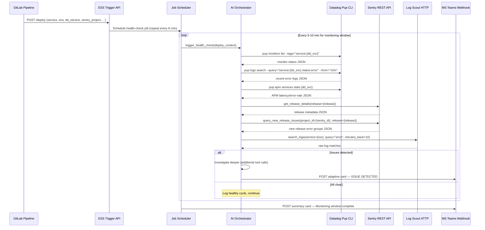
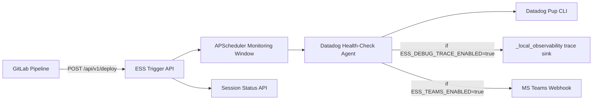

# ESS — Eye of Sauron Service

> *"One service to watch them all, one service to find them,
> one service to alert them all, and in the Teams channel bind them."*

## Deliverable Plans

This master plan is broken into three implementable deliverables:

1. **[Datadog Pup CLI Integration](../implemented/ess-datadog-pup-integration.md)** — PupTool adapter, health-check and investigation methods, Bedrock tool schemas, Docker install, circuit breaker (25-35h)
2. **[Sentry Integration](../backlog/ess-sentry-integration.md)** — implemented release-aware REST API client plus deferred Phase S5 MCP follow-on work (20-30h)
3. **[Log Scout: Syslog Search Agent](../backlog/ess-log-scout-syslog-agent.md)** — Standalone HTTP microservice on syslog servers, ripgrep search, ESS client adapter, per-host routing (30-40h)

The **foundation** (Phase 1: trigger API, scheduler, config, Bedrock auth) and **orchestration** (Phase 3: ReAct loop, escalation, context management) remain in this master plan as they span all three tool verticals.

Before the full multi-tool ESS is complete, this master plan now includes a narrowed shipping path: **Phase 1.5 — Self-Unattended and Inspectable Datadog Deliverable**. It pulls forward the minimum slices of orchestration, notification, and observability needed to ship a Datadog-only post-deploy watcher before Sentry and Log Scout are integrated.

With Phase 1.5 shipped, the next implementation order is intentionally **not** “finish every remaining Phase 2 backend before touching Phase 3.” The planned sequence is:

1. add **Sentry as the second production signal source** through the simpler REST adapter path
2. extend the **existing shipped Datadog agent loop** into a Datadog + Sentry orchestrator
3. defer **Sentry MCP** and **Log Scout** into a later Phase 6 once the REST-backed Datadog + Sentry runtime has proven value

This keeps the next delivery focused on a stronger early shipping result instead of widening scope across too many unfinished integrations at once.

---

## High-Level Architecture

The diagrams below show the **full ESS target architecture**. The immediate next
implementation increment after Phase 1.5 is narrower: **Datadog + Sentry via the
REST adapter**, with Log Scout still deferred.




## Executive Summary

ESS is an agentic AI service that monitors production deployments in real time.
When a GitLab pipeline completes a successful production deploy, it fires an HTTP
request to ESS with full service context. ESS then runs periodic health checks
using Datadog, Sentry, and raw log search tools — all orchestrated by an LLM
reasoning loop — and escalates to MS Teams when issues are detected.

The key insight is that ESS does **not** remediate. It watches, investigates, and
reports. The agent's job is to correlate signals across observability platforms,
understand what went wrong post-deploy, and present a clear, actionable summary
to the engineering team.

## Progress Note — 2026-03-29

Current runtime state:

- Trigger API, scheduler, Datadog Pup adapter, Docker packaging, and Datadog D3 tool definitions are implemented.
- The live health-check path now uses a Datadog-first Bedrock tool loop with deterministic Pup fallback.
- The Sentry REST adapter now includes the release-aware project-details, release-details, and new-release-issue query surface, and degraded Sentry-enabled services now trigger deterministic Sentry follow-up on the live monitoring loop.
- A debug-gated Phase 1.5 trace seam now records observable cycle execution, notification, and completion events when enabled.
- Session results are visible through the API, including `latest_result` on `GET /api/v1/deploy/{job_id}`.
- Teams delivery is now config-gated on the same runtime path for repeated-warning, critical, and end-of-window notifications.
- Full Bedrock-level Datadog + Sentry orchestration, Log Scout integration, advanced escalation, and notification retry policy remain outside the current runtime path.
- Live Datadog smoke validation now passes on the real Bedrock tool path using botocore's native bearer-token support. Re-run 15-minute and 30-minute windows both completed `HEALTHY` on the live Bedrock path; the 60-minute payload remains an optional operator-confidence run rather than a release blocker.

This means ESS can already monitor a deployment window with Datadog-first triage and release-aware Sentry corroboration, but the full multi-tool orchestrator from later phases is not complete yet.

The next milestone is Phase 3: generalising the shipped Datadog-first runtime
into a fuller Datadog + Sentry orchestrator while preserving the current
inspectable and unattended delivery bar. The completed first deliverable is:

- **inspectable** through the session API and structured logs, with an optional debug-gated local trace when deeper inspection is needed
- **unattended and still debuggable** when Teams delivery is enabled via config

---

## Problem Statement

Today, production deploy verification is manual and reactive:
- Engineers deploy and check Datadog dashboards by hand
- Sentry issues may go unnoticed until a customer reports them
- Correlating APM latency spikes, new Sentry errors, and log anomalies requires
  switching between multiple tools and holding context in your head
- There is no systematic post-deploy watch window with escalation

ESS solves this by automating the "experienced SRE watching after a deploy"
pattern with an AI agent that has direct tool access to all observability
platforms.

---

## Technology Evaluation & Decisions

### Decision 1: Datadog Integration — Pup CLI vs. Manual API Client

| Concern | Manual API Client (current log-ai) | Datadog Pup CLI | Recommendation |
|---|---|---|---|
| **Coverage** | 6 hand-built tools (APM, logs, metrics, monitors, events, deps) | 320+ commands across 49 domains | **Pup** |
| **Maintenance** | We own all API format changes, auth handling, pagination | Maintained by Datadog Labs, tracks API client library | **Pup** |
| **Token efficiency** | Returns raw API JSON, agent must parse | Agent-mode returns structured JSON with metadata and hints | **Pup** |
| **Auth** | DD_API_KEY + DD_APP_KEY, manual scope management | OAuth2+PKCE preferred, API key fallback, automatic agent detection | **Pup** |
| **APM** | Manually built SpansListRequest (caused 400s in production) | `pup apm services list/stats/operations/resources` — tested, working | **Pup** |
| **Monitors** | Basic list via datadog-api-client | `pup monitors list/get/search` with tag filtering | **Pup** |
| **Logs** | Manually built LogsListRequest (caused 400s in production) | `pup logs search --query="..." --from="10m"` — proven working | **Pup** |
| **Incidents** | Not implemented | Full incident lifecycle (list, get, attachments, settings) | **Pup** |
| **CI/CD** | Backlog plan only | `pup cicd pipelines/events/tests/dora/flaky-tests` — working | **Pup** |
| **Infrastructure** | `psutil`-based local monitoring | `pup infrastructure hosts list/get` across fleet | **Pup** |
| **Install** | Python pip deps (ddtrace, datadog, datadog-api-client) | Single binary, Homebrew, or cargo build | **Pup** |
| **Self-hosted risk** | We own the code | Open source, Apache-2.0, 489 stars, active (v0.33.0, 32 releases) | **Acceptable** |

**Verdict: Use Datadog Pup CLI.**

The current log-ai Datadog integration required extensive manual API client work
that resulted in production 400/403 errors. Pup wraps the same APIs in a tested,
maintained CLI with structured agent-friendly output. It eliminates the entire
class of API format headaches and gives ESS access to 50x more Datadog surface
area (incidents, CI/CD, synthetics, SLOs, etc.) with zero custom code.

**Integration approach**: ESS calls `pup` as a subprocess with
`asyncio.create_subprocess_exec()`, parsing structured JSON output. Environment
variables (`DD_API_KEY`, `DD_APP_KEY`, `DD_SITE`) or OAuth2 login handle auth.
The `--agent` flag or `FORCE_AGENT_MODE=1` ensures machine-optimised responses.

---

### Decision 2: Sentry Integration — Release-Aware REST First, MCP Later

| Concern | REST adapter (ported from log-ai) | Sentry MCP Server (`@sentry/mcp-server`) | Recommendation |
|---|---|---|---|
| **Time to ship** | Lowest; fits current Python runtime and test stack | Higher; adds Node.js and stdio lifecycle work | **REST first** |
| **Coverage needed now** | Covers the v1 release-aware ESS queries: release details, new release issue groups, issue details, and investigation-time traces | Broader API coverage and AI-powered search | **REST first** |
| **Operational complexity** | Single async HTTP client in-process | Extra subprocess, transport, and packaging concerns | **REST first** |
| **Self-hosted fit** | Straightforward with existing host/token config | Supported, but adds more moving parts | **REST first** |
| **Upgrade path** | Can later sit behind the same tool interface | Strong long-term option | **MCP later** |

**Verdict: Use the Sentry REST adapter as the primary next implementation step, with Sentry MCP explicitly deferred to Phase 6.**

The current goal is to add a second production signal source quickly and safely so
the shipped Datadog monitor can evolve into a more valuable Datadog + Sentry
orchestrator without waiting on every backend integration. For that reason, the
Phase 2 priority is the simpler REST path first.

**Integration approach**:
1. **Primary path now**: Direct Sentry REST API calls for the release-aware v1
    flow: project details, release details, new release issue groups, issue
    details, and traces only for latency investigation.
2. **Canonical query shape**: keep `release:"..." firstSeen:>=effective_since`
    as the default because ESS must preserve deploy-time precision; the tested
    `first-release:"..."` query is a validated alternate, not the default.
3. **Fresh data policy**: fetch release details on every Sentry investigation
    cycle in v1; do not add caching yet.
4. **Future upgrade path**: once the expanded runtime is stable, evaluate Sentry
    MCP stdio transport in Phase 6.

---

### Decision 3: Log Search — Local Agent on Syslog Server

| Concern | Port to ESS directly | Call log-ai MCP over SSH | Local log agent (new) | Recommendation |
|---|---|---|---|---|
| **Network traffic** | ESS must be on syslog box or mount logs via NFS | SSH per search, latency | Agent local to syslog, zero network for search | **Local agent** |
| **Coupling** | ESS owns search code | Depends on log-ai process | Thin agent, ESS orchestrates | **Local agent** |
| **Complexity** | Full ripgrep + service resolution in ESS | MCP JSON-RPC over SSH | Small HTTP/MCP service, minimal logic | **Local agent** |
| **Scalability** | ESS tied to one syslog server | One SSH session per search | Agent handles local I/O, ESS stays stateless | **Local agent** |
| **Reuse** | Duplicates log-ai code | Reuses log-ai directly | New lightweight service, shares log-ai patterns | **Local agent** |

**Verdict: Deploy a lightweight local log-search agent on the syslog server.**

ESS should NOT run on the syslog server or mount remote log volumes. Instead, a
small local agent ("ESS Log Scout") runs on the syslog server and exposes a
minimal HTTP API or MCP stdio endpoint that ESS calls remotely. This approach:

1. **Avoids network traffic for log data** — ripgrep runs locally, only results
   are sent back to ESS over the wire.
2. **Keeps ESS stateless and portable** — ESS can run anywhere (k8s, ECS, etc.)
   without filesystem access to logs.
3. **Reuses proven patterns** — the log scout is derived from log-ai's search
   implementation (ripgrep subprocess, `services.yaml` resolution, UTC handling)
   but packaged as a standalone microservice instead of an MCP server.
4. **Supports multiple syslog servers** — ESS can call different log scouts for
   different regions or environments.

**Integration approach**: ESS calls the log scout via HTTP (`POST /search`) with
service name, query, and time range. The scout returns matched log entries as
JSON. A separate plan should be created for the log scout service itself.

> **Future plan needed**: "ESS Log Scout — Lightweight Log Search Agent" covering
> the scout's API design, deployment on syslog servers, auth, and how it relates
> to the existing log-ai MCP server (which can continue serving interactive agent
> use cases independently).

---

### Decision 4: Agentic AI Framework — Build vs. Framework

| Concern | Custom tool loop | LangGraph | CrewAI | OpenAI Agents SDK | Recommendation |
|---|---|---|---|---|---|
| **Control** | Full | Medium | Low | Medium | Custom or LangGraph |
| **Complexity** | Low-medium | Medium | High | Medium | Custom |
| **Dependencies** | Just LLM SDK | langchain ecosystem | crewai + deps | openai SDK | Custom = minimal |
| **Observability** | Roll your own | LangSmith | CrewAI dashboard | OpenAI traces | Datadog Pup covers this |
| **LLM flexibility** | Any provider | Any via langchain | Any via litellm | OpenAI only | Custom or LangGraph |
| **Token management** | Manual | Built-in | Built-in | Built-in | Manual is fine |
| **Maturity** | Proven pattern | Mature | Maturing | Newer | Custom or LangGraph |

**Verdict: Start with a custom tool-calling loop; evaluate LangGraph for Phase 3+.**

ESS's orchestration pattern is straightforward:
1. Receive deploy context
2. Run a fixed set of health-check tool calls
3. If anomalies detected, reason about them and run deeper investigation calls
4. Summarise and publish

This is a classic ReAct loop that does not require a heavyweight framework. A
custom implementation using direct LLM API calls (Claude via AWS Bedrock or
Anthropic API, with OpenAI as fallback) keeps the dependency footprint minimal
and the behaviour fully transparent.

The orchestrator must preserve ESS's existing **multi-service trigger** model.
One deploy event can contain multiple service targets; triage must still run
across all services in the trigger, deeper investigation can focus on the
affected subset, and the cycle result must remain aggregated by service.

If the agent's reasoning needs become more complex (multi-step investigation
graphs, parallel investigation branches, human-in-the-loop escalation), LangGraph
is the natural upgrade path because it models agent workflows as explicit state
machines.

**Recommended LLM**:
- **Current runtime triage and investigation cycles**: Claude Sonnet 4.6 (`global.anthropic.claude-sonnet-4-6`)
    via AWS Bedrock — validated for both the initial Datadog tool pass and deeper investigation turns.
- **Future optimisation option**: re-evaluate a cheaper triage model after the first deliverable is fully validated.
- **Fallback**: deterministic Pup triage if Bedrock is unavailable or returns no tool calls.

**Bedrock auth**: Keep the bearer token in `AWS_BEARER_TOKEN_BEDROCK` and let
botocore's native Bedrock bearer-token support consume it. Do not decode it
into raw AWS access-key/secret pairs in application code. See Decision 8
(Bedrock Auth) below.

---

### Decision 5: HTTP Framework for Trigger API

| Concern | FastAPI | Flask | Hono (Python) | Recommendation |
|---|---|---|---|---|
| **Async native** | Yes (ASGI) | No (WSGI) | N/A | **FastAPI** |
| **Validation** | Pydantic built-in | Manual | N/A | **FastAPI** |
| **Ecosystem** | Mature, large | Mature, large | N/A | **FastAPI** |
| **Performance** | Excellent (uvicorn) | Good | N/A | **FastAPI** |
| **Fit with ESS** | Pydantic models, async handlers, OpenAPI docs | Would need async bolt-ons | N/A | **FastAPI** |

**Verdict: FastAPI.** It's async-native, uses Pydantic for request validation (matching
log-ai's config conventions), auto-generates OpenAPI docs for the trigger
endpoint, and runs on uvicorn for production.

---

### Decision 6: Job Scheduler

| Concern | APScheduler | Celery + Beat | Custom asyncio | Recommendation |
|---|---|---|---|---|
| **Complexity** | Low | High (requires broker) | Very low | **APScheduler** |
| **Persistence** | Optional (SQLite, Redis) | Redis/RabbitMQ required | None | **APScheduler** |
| **Dynamic jobs** | Yes — add/remove at runtime | Yes but complex | Manual | **APScheduler** |
| **Async support** | Yes (AsyncIOScheduler) | Yes via async worker | Native | **APScheduler** |
| **Fit** | Perfect for "run every N minutes for M minutes" | Overkill for ESS v1 | Too basic | **APScheduler** |

**Verdict: APScheduler (AsyncIOScheduler).** Each deploy trigger creates a
recurring job that runs every N minutes for the monitoring window, then
self-removes. APScheduler handles this natively with minimal configuration.

---

### Decision 7: MS Teams Notification

| Concern | Incoming Webhook (Adaptive Cards) | MS Graph API | Power Automate | Recommendation |
|---|---|---|---|---|
| **Setup** | Channel webhook URL, no app registration | App registration, OAuth | Flow creation | **Webhook** |
| **Capabilities** | Rich adaptive cards, images, actions | Full Teams API | Full but slow | **Webhook** |
| **Auth** | Webhook URL is the secret | OAuth2 client credentials | Microsoft account | **Webhook** |
| **Complexity** | POST JSON to URL | Token management, scopes | No-code but brittle | **Webhook** |

**Verdict: MS Teams Incoming Webhook with Adaptive Cards.** Simplest integration,
supports rich formatting for health reports, requires only a webhook URL.

---

### Decision 8: Bedrock Authentication — Bearer Token

ESS keeps Bedrock auth in `AWS_BEARER_TOKEN_BEDROCK` and routes it through
`ESSConfig` so botocore can use its native bearer-token support:

```python
# config/.env
AWS_BEARER_TOKEN_BEDROCK=ABSK<Base64(key_id:secret)>
AWS_BEDROCK_REGION=us-west-2
AWS_EC2_METADATA_DISABLED=true
```

At startup, `ESSConfig` syncs config-owned runtime overrides for botocore and
subprocesses:
1. Preserves `AWS_BEARER_TOKEN_BEDROCK` for native Bedrock auth
2. Syncs `AWS_DEFAULT_REGION`
3. Syncs `AWS_EC2_METADATA_DISABLED=true` to avoid local IMDS timeouts
4. Exposes typed helpers for subprocess environments instead of direct app-level env access

The boto3 `bedrock-runtime` client then uses standard AWS credential chain:
```python
import boto3
client = boto3.client(
    service_name="bedrock-runtime",
    region_name=config.aws_bedrock_region,
    # Native bearer-token auth is provided through config-owned runtime env wiring
)
response = client.converse(
    modelId="global.anthropic.claude-sonnet-4-6",
    messages=[...],
    toolConfig={...},
)
```

This avoids storing raw AWS key/secret pairs in config files and keeps all
runtime environment mutation inside `src/config.py`.

---

### Decision 9: First-Ship Runtime Mode — Teams Gate, Debug Trace, and OpenTelemetry Forward Path

For the narrowed first ship, ESS needs one runtime path with configurable
notification delivery and a debug-only local trace bridge that can graduate into
OpenTelemetry export in Phase 5 without rewriting the agent loop.

| Concern | Teams-only mode | Always-on local trace mode | Teams gate + debug-only local trace bridge | Recommendation |
|---|---|---|---|---|
| Human alerting | Yes | No | Yes when enabled | Teams gate + debug-only local trace bridge |
| Local inspectability | Weak | Strong | Strong when debug is enabled | Teams gate + debug-only local trace bridge |
| Production data retention risk | Medium | High | Low by default | Teams gate + debug-only local trace bridge |
| Path to OpenTelemetry | Weak | Weak | Strong | Teams gate + debug-only local trace bridge |
| Scope fit for first ship | Good | Overreaches | Best | Teams gate + debug-only local trace bridge |

**Verdict: Gate Teams with config, keep the local trace sink debug-only, and shape the instrumentation so Phase 5 can promote the same events into OpenTelemetry export.**

Recommended configuration shape:

- `ESS_TEAMS_ENABLED=false` → ESS performs no outbound Teams actions
- `ESS_TEAMS_ENABLED=true` → ESS posts Teams notifications from the same runtime path
- `ESS_DEBUG_TRACE_ENABLED=false` → default; ESS does not write a local trace file
- `ESS_DEBUG_TRACE_ENABLED=true` → enable a local debug trace sink for the running process
- `ESS_AGENT_TRACE_PATH=_local_observability/agent_trace.jsonl` → optional override; only honoured when `ESS_DEBUG_TRACE_ENABLED=true`

The trace should capture the full **observable agent trace** for each cycle:

- deploy/session context summary
- Bedrock request/response envelopes
- tool uses and validated tool inputs
- tool results and normalised findings
- fallback events
- notification decisions and outcomes
- final cycle and end-of-window summaries

ESS should **not** treat raw private chain-of-thought as a stable logging surface. The supported trace is the agent's prompts, actions, tool evidence, assistant outputs, and final conclusions.

Implementation constraint for Phase 1.5:

- emit these records through a small instrumentation layer with typed event models
- preserve timestamps, correlation IDs, parent/child relationships, and attributes in an OpenTelemetry-friendly shape
- keep the local JSONL sink as a debug aid only
- defer the Phase 5 decision about OTLP exporter destination, collector topology, and long-term storage

---

## Detailed Phase Design

### Phase 1 — Foundation & Trigger API

**Goal**: A running service that accepts deploy-trigger HTTP requests from GitLab
pipelines and schedules timed health-check jobs.

#### E1.1 — Scaffold ESS repo and Python project structure

Create the project with uv, following log-ai conventions:

```
ess/
├── pyproject.toml
├── AGENTS.md
├── README.md
├── config/
│   ├── .env.example
│   └── services.yaml          # shared format with log-ai
├── src/
│   ├── __init__.py
│   ├── main.py                # FastAPI app entry point
│   ├── config.py              # pydantic-settings config loader
│   ├── models.py              # deploy event schema, health check models
│   ├── scheduler.py           # APScheduler job management
│   ├── llm_client.py          # Bedrock converse client (bearer token auth)
│   ├── tools/                 # tool adapters (Phase 2)
│   ├── agent/                 # AI orchestrator (Phase 3)
│   └── notifications/         # MS Teams publisher (Phase 4)
├── tests/
├── docs/
│   ├── README.md
│   └── plans/
└── .agents/skills/            # mirrored from log-ai
```

#### E1.2 — Implement HTTP trigger endpoint

A single deploy trigger can contain **multiple services** (e.g., a main service
plus a scheduler sidecar). Each service in the `services` array has its own
Datadog, Sentry, and log-search config because services may run on different
infrastructure (K8s vs. ECS Fargate) with different naming conventions.

```python
# POST /api/v1/deploy
{
    "deployment": {
        "gitlab_pipeline_id": "12345",
        "gitlab_project": "group/repo",
        "commit_sha": "abc123def",
        "release_version": "2.4.6",
        "deployed_by": "jane.doe",
        "deployed_at": "2026-03-22T14:30:00Z",
        "environment": "production",
        "regions": ["ca", "us"]              # one trigger, multiple regions
    },
    "services": [
        {
            "name": "hub-ca-auth",                    # log service name
            "datadog_service_name": "example-auth-service",
            "sentry_project": "auth-service",
            "sentry_project_id": 47,
            "sentry_dsn": "https://...",              # optional
            "infrastructure": "k8s",                   # k8s | ecs-fargate
            "log_search_host": "syslog-ca.example.com" # which log scout to call
        },
        {
            "name": "hub-ca-auth-scheduler",           # sidecar scheduler
            "datadog_service_name": "example-auth-scheduler",
            "sentry_project": "auth-scheduler",
            "sentry_project_id": 48,
            "infrastructure": "ecs-fargate",
            "log_search_host": "syslog-ca.example.com"
        }
    ],
    "monitoring": {
        "window_minutes": 30,                # how long to watch (default: 30)
        "check_interval_minutes": 5,         # how often to check (default: 5)
        "teams_webhook_url": "https://..."   # where to post alerts
    },
    "extra_context": {}                      # arbitrary metadata
}
```

Response: `202 Accepted` with:
```json
{
    "job_id": "ess-abc123",
    "status": "scheduled",
    "services_monitored": 2,
    "checks_planned": 6,
    "regions": ["ca", "us"]
}
```

For each health-check cycle, ESS runs triage across **all services** in the
trigger. If one service shows anomalies, investigation focuses on that service
independently. The final report aggregates per-service findings.

#### E1.3 — Define deploy-event schema

Pydantic v2 models with validation:
- `deployment`: required block with `environment`, `gitlab_pipeline_id`, `commit_sha`, and `release_version` when Sentry-enabled services are present
- `services`: list of 1+ `ServiceTarget` models, each requiring `name` and `datadog_service_name`, plus `sentry_project_id` for Sentry-enabled services
- `monitoring`: optional block with defaults (`window_minutes=30`, `check_interval_minutes=5`)
- `regions`: list of region codes (e.g., `["ca", "us"]`)
- Validate `environment` is one of known values
- Validate `teams_webhook_url` is a valid HTTPS URL when provided
- Validate at least one service in the `services` array

#### E1.4 — Implement job scheduler

APScheduler `AsyncIOScheduler`:
- On deploy trigger: create an interval job (every `check_interval_minutes`)
- Job runs `health_check(deploy_context)` on each tick
- After `monitoring_window_minutes`, auto-remove the job and post summary
- Support cancellation via `DELETE /api/v1/deploy/{job_id}`
- Store active jobs in memory (v1) with Redis persistence (v2)

#### E1.5 — Configuration layer

Pydantic-settings config matching log-ai conventions:

```python
class ESSConfig(BaseSettings):
    model_config = SettingsConfigDict(env_file="config/.env")

    # LLM — Bedrock with bearer token auth
    llm_provider: str = "bedrock"         # bedrock | anthropic | openai
    triage_model: str = "global.anthropic.claude-sonnet-4-6"
    investigation_model: str = "global.anthropic.claude-sonnet-4-6"
    aws_bedrock_region: str = "us-west-2"
    aws_bearer_token_bedrock: str = ""    # ABSK<Base64(key_id:secret)>
    aws_ec2_metadata_disabled: bool = True

    # Datadog (for Pup CLI)
    dd_api_key: str
    dd_app_key: str
    dd_site: str = "datadoghq.com"

    # Sentry
    sentry_auth_token: str
    sentry_host: str = "sentry.example.com"
    sentry_org: str = "example"

    # Log scout (local agent on syslog servers)
    default_log_scout_url: str = "http://syslog.example.com:8090"

    # Defaults
    default_monitoring_window_minutes: int = 30
    default_check_interval_minutes: int = 5
    max_monitoring_window_minutes: int = 120

    # MS Teams
    default_teams_webhook_url: Optional[str] = None

    def model_post_init(self, __context) -> None:
        """Sync config-owned runtime overrides for botocore and subprocesses."""
        for key, value in self.runtime_environment().items():
            os.environ[key] = value

    def runtime_environment(self) -> dict[str, str]:
        env: dict[str, str] = {}
        if self.aws_bearer_token_bedrock:
            env["AWS_BEARER_TOKEN_BEDROCK"] = self.aws_bearer_token_bedrock
        if self.aws_bedrock_region:
            env["AWS_DEFAULT_REGION"] = self.aws_bedrock_region
        if self.aws_ec2_metadata_disabled:
            env["AWS_EC2_METADATA_DISABLED"] = "true"
        return env
```

#### E1.6 — Tests

- Trigger endpoint validation (valid/invalid payloads)
- Scheduler job creation, execution counting, auto-cleanup
- Config loading with missing/invalid values

#### E1.7 — Documentation

- README with project overview and quickstart
- AGENTS.md adapted from log-ai template
- docs/README.md with plan tracking

---

### Phase 1.5 — Self-Unattended and Inspectable Datadog Deliverable

**Goal**: Ship a narrowed first ESS deliverable that monitors a Datadog-backed deploy window for 30-60 minutes using the existing trigger API, scheduler, Pup integration, and Datadog agent loop, while supporting both inspectable and unattended operation.



This phase deliberately pulls forward the minimum viable slices of Phases 3, 4,
and 5 needed to ship a useful Datadog-only watcher before Sentry and Log Scout
are integrated.

#### E15.1 — Datadog-only health-check agent loop

Build on the existing Datadog-only Bedrock tool loop so each scheduler tick:

1. builds deploy-aware prompts from the trigger payload
2. executes Datadog tool calls through the Bedrock tool layer
3. falls back to deterministic Pup triage if the LLM path fails
4. produces a `HealthCheckResult` stored on the in-memory session

Deliverables:

- Datadog-only agent loop in `src/agent/health_check_agent.py`
- wiring from `src/main.py` into scheduler-driven monitoring
- session visibility via `GET /api/v1/deploy/{job_id}`

Verification:

- repeated checks execute for the full monitoring window
- failures in the LLM path do not break monitoring
- latest result remains inspectable through the API

#### E15.2 — Debug-gated local trace bridge

Add a debug-only local trace sink under `_local_observability/`, defaulting to
`_local_observability/agent_trace.jsonl`, as a bridge toward later OpenTelemetry-based observability.

Required behavior:

- `ESS_DEBUG_TRACE_ENABLED=false` is the default and writes no local trace file
- `ESS_DEBUG_TRACE_ENABLED=true` enables the local debug trace sink
- `ESS_AGENT_TRACE_PATH` is optional and is only used when debug tracing is enabled
- the local sink is fed by a dedicated instrumentation layer rather than agent business logic writing JSONL directly
- trace event envelopes use typed models and an OpenTelemetry-friendly shape so Phase 5 can replace or augment the file sink without a big-bang rewrite

Trace events must include at least:

- cycle started / completed
- Bedrock request metadata and assistant outputs
- tool uses, validated inputs, and tool results
- per-cycle findings and severities
- fallback events and errors
- notification attempts and outcomes
- end-of-window summary

Design constraint:

- trace the full **observable execution path**
- do **not** rely on raw chain-of-thought as a product surface
- keep the local file sink debug-only rather than making it a permanent production observability surface
- preserve timestamps, correlation identifiers, and parent/child execution relationships needed for later OpenTelemetry export

Verification:

- when debug tracing is disabled, no local trace file is written
- when debug tracing is enabled, one monitoring session produces a readable chronological event stream under `_local_observability/`
- operators can reconstruct what the agent did without polling the API continuously when debug tracing is enabled
- the instrumentation seam is reusable by Phase 5 observability work without changing agent orchestration logic

#### E15.3 — Teams mode gate and completion callback

Pull forward the minimal notification path from Phase 4 using config-driven mode selection.

Required behavior:

- `ESS_TEAMS_ENABLED=false` disables outbound Teams posts entirely
- `ESS_TEAMS_ENABLED=true` enables Teams notifications for the same runtime path
- `ESS_DEBUG_TRACE_ENABLED` only controls the local debug sink and does not change notification policy
- completion callback in `src/main.py` becomes real instead of stubbed
- webhook URL comes from trigger payload or default config
- Teams delivery uses bounded async HTTP calls with explicit timeouts; richer retry policy remains Phase 4 work

Verification:

- Teams-disabled mode performs no network calls to Teams
- debug tracing can be enabled or disabled independently of Teams mode
- Teams-enabled mode attempts webhook delivery through the same cycle results

#### E15.4 — Minimal unattended notification policy

Implement the smallest useful unattended policy for the Datadog-only ship:

- immediate notification for `CRITICAL`
- notification after repeated `WARNING` cycles
- final summary at end of monitoring window

This phase only needs minimal card/report content for Datadog-only monitoring.
Advanced threaded investigations and multi-tool correlation remain in later phases.

Implementation note:

- notification decisions and delivery outcomes should flow through the same instrumentation layer used by the debug trace sink so Phase 5 can export them as OpenTelemetry events later

Verification:

- warning, critical, and summary paths are independently testable
- notification failures are logged into the structured trace

#### E15.5 — Datadog-only shipping validation

Validate the narrowed ship path with realistic GitLab-style payloads and monitoring windows.

Scope:

- example trigger payloads for 30-minute and 60-minute windows
- local runbook for triggering ESS from a GitLab-compatible curl payload
- targeted integration coverage for Datadog-only scheduling plus notification/trace behavior

Verification:

- a single trigger can monitor the service for the configured window without human polling
- trace-only and Teams-enabled modes both complete successfully

#### E15.6 — Documentation for the narrowed first ship

Add a Datadog-only shipping guide covering:

- required `.env` variables
- mode behavior (`ESS_TEAMS_ENABLED` false vs true)
- debug trace behavior (`ESS_DEBUG_TRACE_ENABLED` and optional `ESS_AGENT_TRACE_PATH`)
- trace event shape and how it maps cleanly to later OpenTelemetry export
- what the API exposes during the monitoring window
- what is intentionally out of scope (Sentry, Log Scout, advanced multi-tool investigation)

#### E15.7 — Review gate

Run `review-plan-phase` against Phase 1.5 before considering the narrowed first ship complete.

---

### Phase 2 — Tool Integration Layer (Sentry-First)

**Goal**: ESS can execute Datadog and Sentry queries and normalise results into a
format the orchestrator can consume, while intentionally deferring Log Scout
until the broader multi-tool runtime has proven value.

#### E2.1 — Datadog Pup CLI adapter

```python
class PupTool:
    """Execute Datadog Pup CLI commands as async subprocesses."""

    async def execute(self, args: list[str], timeout: int = 60) -> dict:
        """Run `pup <args>` and return parsed JSON."""
        env = {
            "DD_API_KEY": self.config.dd_api_key,
            "DD_APP_KEY": self.config.dd_app_key,
            "DD_SITE": self.config.dd_site,
            "FORCE_AGENT_MODE": "1",
        }
        runtime_env = self.config.pup_subprocess_environment()
        proc = await asyncio.create_subprocess_exec(
            "pup", *args, "--output", "json",
            stdout=PIPE, stderr=PIPE, env=runtime_env
        )
        stdout, stderr = await asyncio.wait_for(
            proc.communicate(), timeout=timeout
        )
        return json.loads(stdout)

    # Convenience methods
    async def get_monitor_status(self, service: str, env: str) -> dict:
        return await self.execute([
            "monitors", "list",
            f'--tags=service:{service},env:{env}'
        ])

    async def search_error_logs(self, service: str, minutes: int) -> dict:
        return await self.execute([
            "logs", "search",
            f'--query=service:{service} status:error',
            f'--from={minutes}m'
        ])

    async def get_apm_stats(self, service: str, env: str) -> dict:
        return await self.execute([
            "apm", "services", "stats", service,
            f"--env={env}"
        ])

    async def get_recent_incidents(self) -> dict:
        return await self.execute(["incidents", "list"])

    async def get_infrastructure_health(self, service: str) -> dict:
        return await self.execute([
            "infrastructure", "hosts", "list",
            f'--filter=service:{service}'
        ])
```

ESS installs Pup via Homebrew in the container (`brew install datadog-labs/pack/pup`)
or includes the pre-built binary in the Docker image.

#### E2.2 — Sentry adapter

Primary approach — direct, release-aware REST API calls:

```python
class SentryTool:
    """Query self-hosted Sentry for release-aware post-deploy evidence."""

    async def get_project_details(self, project_slug: str) -> dict: ...

    async def get_release_details(self, release_version: str) -> dict: ...

    async def query_new_release_issues(
        self,
        project: str | int,
        environment: str,
        release_version: str,
        effective_since: datetime,
    ) -> dict: ...

    async def get_issue_details(self, issue_id: str) -> dict: ...
```

This Phase 2 slice is now implemented on the current runtime path. It added the
second production signal source with the smallest operational and packaging
surface area while aligning the Sentry query surface with ESS's release-centric
deploy context.

Implementation requirements:

- Require `deployment.release_version` and `services[].sentry_project_id` for
    Sentry-enabled services in real deploy payloads.
- Fetch release details each investigation cycle and compute
    `effective_since = max(deployment.deployed_at, release.dateCreated)`.
- Default to the query shape
    `release:"{release}" firstSeen:>={effective_since} is:unresolved issue.category:error`.
- Treat `first-release:"{release}"` as a tested alternate on the self-hosted
    instance, but not the canonical filter, because ESS must preserve
    deploy-time precision.
- Validate external Sentry responses into typed pydantic boundary models before they are exposed to the agent layer.
- Keep all auth and host configuration in `ESSConfig`; do not read raw environment variables in the adapter.
- Use explicit aiohttp timeouts, bounded 429 retry handling, a circuit breaker, and a concurrency limit so the adapter matches ESS async-safety rules.
- Add typed Sentry settings on `ESSConfig` for request timeout, concurrency limit, and any circuit-breaker thresholds used by the adapter; do not hide these as adapter-local magic numbers.
- Do not cache release details in v1; prefer fresh reads per investigation cycle.

Future upgrade path: Phase 6 may replace or augment this with Sentry MCP stdio
transport if the release-aware REST runtime proves insufficient.

#### E2.3 — Unified tool-result normalisation for Sentry

Datadog already uses this shape today. Phase 2 extends it for Sentry so the
orchestrator can consume both signal sources through one contract.

All tool adapters return a common shape:

```python
@dataclass
class ToolResult:
    tool: str           # "datadog.monitor_status", "sentry.new_release_issues", "logs.search"
    success: bool
    data: dict | list   # normalised payload
    summary: str        # one-line human-readable summary
    error: str | None
    duration_ms: int
    raw: dict           # original response for debugging
```

The orchestrator works with `ToolResult` objects, not raw JSON from different APIs.

The Sentry extension of this contract should include:

- stable tool names for project details, release details, new release issues, and issue details
- summaries suitable for Bedrock `toolResult` content
- raw payload retention for trace/debug use
- pydantic-validated adapter output before normalisation

#### E2.4 — Tests for the Sentry adapter and Bedrock tool layer

- Unit tests for the Sentry adapter with mocked HTTP responses
- Validation tests for boundary models and normalisation helpers
- Resilience tests for timeout handling, bounded 429 retry behaviour, and circuit breaker state
- Bedrock tool-layer tests for Sentry tool definitions and result mapping
- Integration tests with real Datadog/Sentry where practical (marked `@pytest.mark.integration`)

#### E2.5 — Documentation update — Sentry-first tool integration guide

Document:

- required `.env` variables and scopes for Sentry
- release-aware query shapes, including the canonical `release + firstSeen` filter
- REST-first implementation choice and why MCP is deferred to Phase 6
- timeout, retry, and circuit-breaker behaviour
- how Sentry findings flow into the shared `ToolResult` and agent workflow

#### E2.6 — Release-aware deploy context and project identity

- Add `deployment.release_version` to the deploy schema.
- Require `services[].sentry_project_id` for Sentry-enabled services.
- Update trigger examples, tests, and prompt-building so the orchestrator has
    the exact release identity that Sentry uses.

Status:

- Implemented on 2026-03-29 in the current Datadog-first runtime foundation.
- Schema validation, checked-in example fixtures, and realistic local trigger
    helpers now carry release-aware Sentry identity.

#### E2.7 — Release-aware query surface, tool cleanup, and orchestration seam

- Implement project-details and release-details lookups.
- Implement the new release issue-group query using `effective_since`.
- Keep issue details as the investigation path and leave trace and latency investigation on Datadog.
- Ensure Phase 3 orchestration uses Datadog first, then Sentry only when
    Datadog indicates a problem.

Historical planning notes for this implemented phase:

- Treat the current generic `query_issues(...)` and `sentry_query_issues` surfaces
    as migration targets rather than permanent v1 APIs.
- Remove generic issue search from the default Sentry tool config once the
    release-aware query path lands.
- Do not retain a Sentry trace-search surface in the shipped REST path; Datadog
    already covers traces and latency investigation for this runtime.
- Update schema fixtures and tests in the same migration, especially
    `docs/examples/triggers/example-service-e2e.json`, `tests/test_models.py`,
    `tests/test_sentry_tool.py`, `tests/test_sentry_tools.py`, and
    `tests/test_health_check_agent.py`.

---

### Phase 3 — Agentic AI Orchestration

**Goal**: An LLM-driven reasoning loop that runs health checks, detects anomalies,
investigates root cause, and produces actionable reports.

Phase 1.5 already shipped the first real slice of this work in the form of the
Datadog-only agent loop. Phase 3 therefore starts from the shipped runtime,
generalising it into a broader orchestrator instead of replacing it.

The immediate Phase 3 target is a **Datadog + Sentry orchestrator** built on the
release-aware Sentry plan. Log Scout remains a later Phase 6 expansion once the
two-signal runtime is stable.

#### E3.1 — Agent orchestrator

Generalise the shipped Datadog loop into a multi-tool ReAct orchestrator:

```python
class HealthCheckAgent:
    """LLM-driven post-deploy health check agent."""

    def __init__(self, bedrock_client, tools: list[Tool], deploy_ctx: DeployContext):
        self.bedrock = bedrock_client
        self.tools = {t.name: t for t in tools}
        self.deploy_ctx = deploy_ctx
        self.conversation: list[Message] = []
        self.max_iterations = 15       # safety bound
        self.max_tokens_budget = 50000 # context limit
        # Current runtime model selection: Sonnet for triage and investigation
        self.triage_model = "global.anthropic.claude-sonnet-4-6"
        self.investigation_model = "global.anthropic.claude-sonnet-4-6"
        self.current_model = self.triage_model

    async def run_health_check(self) -> HealthCheckResult:
        """Execute one health-check cycle."""
        self.conversation = [self._build_system_prompt()]
        self.conversation.append(self._build_check_prompt())

        for i in range(self.max_iterations):
            response = await self.bedrock.converse(
                modelId=self.current_model,
                messages=self.conversation,
                toolConfig=self._tool_config(),
            )

            if response.stop_reason == "end_turn":
                return self._parse_report(response.content)

            if response.stop_reason == "tool_use":
                results = await self._execute_tool_calls(response.tool_calls)
                self.conversation.append(response)
                self.conversation.append(self._tool_results_message(results))

                # Context window management
                if self._token_count() > self.max_tokens_budget * 0.8:
                    await self._summarise_and_compact()

        return self._timeout_report()
```

#### E3.2 — System prompt and tool descriptions

The next prompt revision instructs the agent:
- You are a post-deploy health monitor for one deployment that may include multiple services in `{env}`
- Your job is to check whether the deployment is healthy
- You have access to Datadog and Sentry tools, with log search added later
- Run standard health checks first for every service target (monitors, error logs, APM stats)
- Use Sentry only after Datadog indicates a warning, critical, latency, or post-deploy error symptom
- Use the exact deploy `release_version` and the required `sentry_project_id` for Sentry correlation
- If anomalies are found, investigate deeper using additional tool calls
- Produce a structured health report with per-service findings, an overall severity, and recommendations
- You must NOT take any remediation actions — observation and reporting only
- Be concise — summarise tool outputs instead of repeating them

Tool descriptions follow OpenAI/Anthropic function-calling format with clear
parameter schemas and usage guidance.

#### E3.3 — Health-check workflow

Each check cycle follows this pattern across all services in the trigger:

1. **Triage** (always runs):
   - Check Datadog monitors for the service → any alerting/warning?
   - Search Datadog logs for errors in the last N minutes
   - Get APM latency and error rate stats
    - If Datadog is degraded, fetch Sentry release details and query only issue groups first seen after `effective_since`

2. **Investigate** (runs if triage finds anomalies):
   - Get specific Sentry issue details (stack trace, affected users)
    - Check APM for slow endpoints or elevated error rates on specific routes
    - Use Datadog APM and traces when latency or failed-request symptoms need deeper investigation
   - Check infrastructure health (host CPU, memory, disk)
    - Correlate: did new issue groups start at or after `effective_since`?

3. **Later expansion**:
     - Add Log Scout-backed raw log correlation in Phase 6 after the Datadog + Sentry path is stable

4. **Report**:
   - Severity: `HEALTHY` | `WARNING` | `CRITICAL`
   - Findings summary with evidence from each tool
   - Correlation analysis (deploy time vs. issue onset)
   - Recommendations (rollback? investigate further? wait and see?)

#### E3.4 — Escalation logic

```python
class MonitoringSession:
    """Tracks escalation state across scheduler-driven health-check cycles."""

    def record_cycle_result(self, report: HealthCheckResult) -> NotificationDecision:
        """Update per-session escalation state after one scheduler tick."""
        if report.overall_severity == "HEALTHY":
            self.consecutive_warnings = 0
            return NotificationDecision.none()

        if report.overall_severity == "WARNING":
            self.consecutive_warnings += 1
            if self.consecutive_warnings >= 2:
                return NotificationDecision.warning(report)
            return NotificationDecision.none()

        if report.overall_severity == "CRITICAL":
            self.consecutive_warnings = 0
            return NotificationDecision.critical(report)

        return NotificationDecision.none()
```

Implementation note: APScheduler remains the only component responsible for
timing and repeated execution. Phase 3 should evolve the per-cycle agent logic
and per-session escalation state, not introduce a second long-running sleep loop
inside the monitoring session object.

#### E3.5 — Context-window management

Long monitoring sessions with many tool calls can exhaust the context window.
Strategy:
- Track approximate token count per message
- When approaching 80% of budget, summarise older tool results into a compact
  digest and remove the raw messages
- Keep the system prompt, deploy context, and most recent 2-3 tool exchanges
  intact
- Use the LLM itself to produce the summary ("Summarise the health check findings
  so far in 200 words")

#### E3.6 — Unit and integration tests for the orchestrator

- Unit tests with mocked LLM responses and tool results
- Test the ReAct loop terminates correctly on healthy, warning, and critical paths
- Test context-window compaction
- Test scheduler-driven escalation state across repeated cycles without introducing a second timing loop

#### E3.7 — Documentation update — orchestration design

- Document the orchestrator architecture as an evolution of the shipped Datadog loop
- Document Datadog + Sentry prompt/tool flow before Log Scout is added
- Document how escalation state works across APScheduler ticks

---

### Phase 4 — Notification & Reporting

**Goal**: ESS posts clear, actionable health reports to MS Teams.

Phase 1.5 pulls forward the minimal Datadog-only unattended notification path.
Phase 4 remains the place for richer card design, threaded investigation updates,
and broader multi-tool reporting.

#### E4.1 — MS Teams webhook publisher

```python
class TeamsPublisher:
    """Send health reports to MS Teams via incoming webhook."""

    async def post_card(self, webhook_url: str, card: dict) -> bool:
        """POST an Adaptive Card to the webhook URL."""
        async with aiohttp.ClientSession() as session:
            payload = {
                "type": "message",
                "attachments": [{
                    "contentType": "application/vnd.microsoft.card.adaptive",
                    "content": card
                }]
            }
            resp = await session.post(webhook_url, json=payload, timeout=30)
            return resp.status == 200
```

#### E4.2 — Adaptive card templates

Three card types:
1. **Health Check — All Clear**: Green accent, service name, "✅ No issues detected",
   check summary (monitors OK, 0 errors, latency normal)
2. **Health Check — Issue Detected**: Red/yellow accent, severity badge, findings
   list, Sentry issue links, Datadog dashboard links, deploy info
3. **Monitoring Summary**: End-of-window report with timeline of all checks,
   overall verdict, recommendation

Cards include:
- Service name, environment, deploy SHA, deployer
- Timestamp and check cycle number
- Direct links to Datadog APM, Sentry project, and relevant dashboards
- Actionable recommendations ("Consider rollback", "Monitor closely", etc.)

#### E4.3–E4.6 — Investigation publisher, retry handling, tests, docs

- Investigation summaries posted as threaded replies to the initial alert card
- Webhook POST retries with exponential backoff (3 attempts, 1s/2s/4s)
- Unit tests with mocked webhook responses
- Configuration guide for setting up MS Teams webhooks

---

### Phase 5 — Deployment, Observability & Hardening

**Goal**: ESS is containerised, observable, and ready for production.

Phase 1.5 pulls forward the `_local_observability`-backed structured agent trace and the narrowed
Datadog-only end-to-end shipping path. Phase 5 still covers broader production
hardening, self-observability metrics, deployment packaging, and final audits.

#### E5.1 — Docker

```dockerfile
FROM python:3.14-slim

# Install Pup CLI
RUN curl -fsSL https://github.com/datadog-labs/pup/releases/latest/download/pup-linux-amd64 \
    -o /usr/local/bin/pup && chmod +x /usr/local/bin/pup

# Note: ripgrep NOT needed in ESS container — log search runs on the
# ESS Log Scout agent deployed on syslog servers

# Install Node.js for Sentry MCP (Phase 6 future upgrade path)
# RUN curl -fsSL https://deb.nodesource.com/setup_20.x | bash - && apt-get install -y nodejs

WORKDIR /app
COPY pyproject.toml .
RUN pip install uv && uv sync --frozen

COPY . .
CMD ["uv", "run", "uvicorn", "src.main:app", "--host", "0.0.0.0", "--port", "8080"]
```

#### E5.2 — GitLab CI integration template

Provide a `.gitlab-ci.yml` snippet teams can add to their pipelines:

```yaml
notify_ess:
  stage: post-deploy
  script:
    - |
      curl -s -X POST "${ESS_URL}/api/v1/deploy" \
        -H "Content-Type: application/json" \
        -d '{
          "deployment": {
            "gitlab_pipeline_id": "'${CI_PIPELINE_ID}'",
            "gitlab_project": "'${CI_PROJECT_PATH}'",
            "commit_sha": "'${CI_COMMIT_SHA}'",
            "deployed_by": "'${GITLAB_USER_LOGIN}'",
            "deployed_at": "'$(date -u +%Y-%m-%dT%H:%M:%SZ)'",
            "environment": "production",
            "regions": ["ca", "us"]
          },
          "services": [
            {
              "name": "'${CI_PROJECT_NAME}'",
              "datadog_service_name": "'${DD_SERVICE_NAME}'",
              "sentry_project": "'${SENTRY_PROJECT}'",
              "infrastructure": "k8s"
            }
          ]
        }'
  only:
    - main
  when: on_success
```

#### E5.3 — Self-observability

- Structured JSON logging (via `structlog` or standard `logging` with JSON formatter)
- `/health` endpoint for container orchestrator probes
- `/api/v1/status` — list active monitoring sessions
- Metrics: active_sessions, checks_executed, alerts_sent, tool_call_duration
- Decide the OpenTelemetry export path for the Phase 1.5 instrumentation layer (exporter destination, collector topology, and whether the debug JSONL sink remains as a local-only fallback)

#### E5.4 — Rate limiting and circuit breakers

- Rate-limit Pup CLI calls (e.g., max 10 concurrent subprocess executions)
- Rate-limit Sentry API calls (respect API rate limits, 429 backoff)
- Circuit breaker: if a tool fails 3 consecutive times, skip it for the remaining
  monitoring window and note in the report
- Global cap: max N simultaneous monitoring sessions (configurable, default 20)

#### E5.5–E5.7 — Integration tests, deployment guide, final audit

- End-to-end test: mock GitLab trigger → health check cycles → Teams notification
- Production deployment guide with infrastructure requirements
- Final `review-plan-phase` audit against this plan

---

## Dependencies Summary

### Runtime

| Dependency | Purpose | Version |
|---|---|---|
| Python | Runtime | 3.14+ |
| FastAPI | Trigger API | Latest |
| uvicorn | ASGI server | Latest |
| pydantic / pydantic-settings | Config, schemas | v2 |
| APScheduler | Job scheduling | 3.x with AsyncIOScheduler |
| aiohttp | Async HTTP (Teams webhook, Sentry API) | 3.9+ |
| boto3 | Bedrock converse client (bearer token auth) | Latest |
| Datadog Pup CLI | Datadog tool access | v0.33+ (binary) |
| aiohttp | Async HTTP (Teams, Sentry, Log Scout) | 3.9+ |

### Optional / Future

| Dependency | Purpose | When |
|---|---|---|
| `@sentry/mcp-server` | Sentry MCP stdio server | Phase 6 expansion |
| Redis | Job persistence, shared state | Phase 5+ |
| LangGraph | Complex investigation workflows | If orchestration outgrows ReAct loop |

---

### Phase 6 — Deferred Expansion Paths

**Goal**: Evaluate and implement broader integrations only after the release-aware
Datadog plus Sentry runtime has proven value in production-style monitoring.

#### E6.1 — Evaluate Sentry MCP stdio transport as a post-v1 expansion path

This evaluation happens only after the release-aware REST-backed Sentry path is
stable. The evaluation should decide:

- whether MCP materially improves the signal quality or operator experience
- whether the added Node.js and stdio lifecycle complexity is justified
- whether REST and MCP should share one tool interface behind a feature flag

#### E6.2 — Optional Sentry MCP backend

- Implement MCP only if E6.1 shows a clear gain over the release-aware REST path.
- Keep REST as the default backend until MCP demonstrates better operational value.

#### E6.3 — Log Scout adapter (remote log search)

This work stays deferred until the Datadog plus Sentry orchestrator is stable.

ESS calls the ESS Log Scout agent running on the syslog server via HTTP:

```python
class LogScoutTool:
    """Call the remote ESS Log Scout agent for log search."""

    async def search(self, service: str, query: str,
                     minutes_back: int = 10,
                     log_scout_url: str | None = None) -> dict:
        """POST to the log scout and return matched entries."""
        url = log_scout_url or self.config.default_log_scout_url
        async with aiohttp.ClientSession() as session:
            resp = await session.post(
                f"{url}/search",
                json={
                    "service": service,
                    "query": query,
                    "minutes_back": minutes_back,
                },
                timeout=aiohttp.ClientTimeout(total=120),
            )
            return await resp.json()
```

The log scout runs on the syslog server, handles ripgrep execution and
`services.yaml` resolution locally, and returns only matched log entries over the
wire. Each service in a deploy trigger can specify a different `log_search_host`
so ESS can query region-specific syslog servers.

> **Note**: The ESS Log Scout is a separate service with its own plan. It shares
> patterns from log-ai but is packaged as a minimal HTTP microservice, not an MCP
> server.

### Not Needed (Replaced by Pup)

| Removed | Reason |
|---|---|
| `ddtrace` | Pup handles APM queries without tracing the ESS process itself |
| `datadog` (DogStatsD) | Pup covers metrics queries; ESS self-metrics can use structlog |
| `datadog-api-client` | Pup wraps all API client functionality |
| `psutil` | Pup `infrastructure hosts` replaces local system monitoring |

---

## Resolved Questions

1. **Auth model for trigger endpoint**: Network-level restriction (GitLab runner
   IP allowlist, VPN) is sufficient for v1. API key auth deferred to future phases.

2. **Multi-region**: One trigger per deploy, with a `regions` list (e.g.,
   `["ca", "us"]`). The trigger supports **multiple services** per deploy (main
   service + sidecar schedulers). Each service has its own DD/Sentry/log config
   because K8s and ECS Fargate services may have different naming conventions.

3. **Rollback recommendation**: Observer only for v1. Rollback recommendations
   deferred to future phases.

4. **Log search access**: ESS does NOT run on the syslog server. Instead, a
   lightweight local agent ("ESS Log Scout") runs on each syslog server and
   exposes an HTTP search endpoint. ESS calls the scout remotely — ripgrep runs
   locally on the syslog box, only results traverse the network. A separate plan
   is needed for the log scout service.

5. **LLM cost budgeting**: Cost is not a blocking concern for the first
    deliverable. The current runtime uses Sonnet 4.6
    (`global.anthropic.claude-sonnet-4-6`) for both Datadog triage and deeper
    investigation turns. All Bedrock calls use bearer-token auth via
    `AWS_BEARER_TOKEN_BEDROCK`.

---

## Success Criteria

### Narrowed First Ship — Phase 1.5

- [x] A GitLab pipeline can trigger ESS with a single curl command
- [x] ESS monitors the Datadog-backed service for the full configured 30-60 minute window
- [x] The Datadog-only agent loop produces coherent per-cycle health results without human polling
- [x] When `ESS_DEBUG_TRACE_ENABLED=true`, a structured local trace records prompts, tool actions, findings, assistant outputs, and final summaries for every cycle
- [x] When `ESS_DEBUG_TRACE_ENABLED=false`, ESS writes no local trace file and remains inspectable through the session API and structured logs
- [x] The Phase 1.5 instrumentation layer preserves an OpenTelemetry-friendly event model so Phase 5 can add exporters without rewriting agent logic
- [x] When `ESS_TEAMS_ENABLED=false`, ESS performs no Teams actions
- [x] When `ESS_TEAMS_ENABLED=true`, ESS sends warning, critical, and end-of-window notifications to Teams
- [x] ESS does NOT take any remediation actions — observation and reporting only

### Full ESS Target

- [ ] ESS correctly queries Datadog via Pup CLI (monitors, logs, APM) for the deployed service
- [ ] ESS correctly queries Sentry for new issue groups in the deployed release using `effective_since`
- [ ] ESS correctly searches raw logs for error patterns post-deploy
- [ ] The AI agent produces a coherent health report correlating signals across all tools
- [ ] MS Teams receives a rich adaptive card within 2 minutes of the first health check
- [ ] If no issues are found across the monitoring window, a summary confirmation is posted
- [ ] If issues are found, the agent autonomously investigates and posts a detailed report
- [ ] The service runs containerised and can be deployed via docker-compose or k8s
