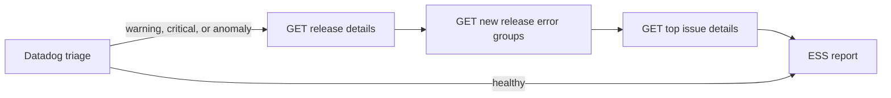

# ESS Deliverable 2 - Sentry Integration

> Deferred status note: Phases S1-S4 are implemented and review-complete on the
> shipped Datadog-first runtime path. This plan now sits in backlog only for the
> remaining Phase S5 future work: evaluating and potentially adding a Sentry MCP
> backend after the current REST-backed runtime has proven value.



## Executive Summary

ESS v1 should use Sentry as a read-only, release-aware corroboration source after
Datadog has already indicated a possible problem. The current REST adapter and
tool layer are good foundations, but the generic "query unresolved issues"
shape is too noisy for release monitoring on the observed self-hosted Sentry
instance. The concrete v1 design is therefore narrower: fetch release metadata,
query only issue groups first seen after the effective release start, and
inspect a small number of issue details. Datadog remains the trace and latency
source for this runtime shape. This document defines the exact HTTP
endpoints, query strings, payload fields, and orchestration rules for that v1.

## V1 Goal

Build the smallest useful Sentry slice for ESS with these constraints:

- Self-hosted Sentry only, over direct HTTP REST calls.
- Datadog remains the primary alarm trigger.
- Sentry contributes release-scoped evidence for the same deploy.
- ESS remains observer-only and never remediates.
- Avoid generic Sentry noise from older unresolved groups or handled or logged
  exceptions that are not deploy regressions.

## Current State

What already exists:

- A resilient async REST adapter in `src/tools/sentry_tool.py`.
- Bedrock-facing Sentry tool definitions in `src/agent/sentry_tools.py`.
- ToolResult normalisation in `src/tools/normalise.py`.
- Unit and live integration-test scaffolding.

Current v1 runtime status:

- Deploy context now carries the exact Sentry release value and required stable
  Sentry project id for Sentry-enabled services.
- Runtime now performs Datadog-first release-aware Sentry follow-up, but it is
  not yet a full Bedrock-level multi-tool orchestrator.
- Datadog remains the trace and latency source; the shipped REST path does not
  query Sentry traces.

## Progress Update - 2026-03-29

Completed in the first S4 implementation slice:

- `deployment.release_version` is now part of the validated deploy schema.
- `services[].sentry_project_id` is now required whenever `sentry_project` is
  present.
- The current health-check prompt and cycle trace attributes now carry
  `release_version`.
- The checked-in example trigger is now anonymized but Sentry-aware.
- Local development triggers under `_local_observability/triggers/` now carry
  the real qa release and project mapping used for realistic Sentry validation.
- Targeted tests covering models, fixtures, prompt context, and example-trigger
  consumers pass.

Completed in the second S4 implementation slice:

- The REST adapter now exposes `get_project_details(...)`,
  `get_release_details(...)`, and `query_new_release_issues(...)`.
- The canonical release-aware query
  `release + firstSeen:>=effective_since + is:unresolved issue.category:error`
  is now implemented in code and covered by tests.
- The default Bedrock Sentry tool config now exposes project details, release
  details, new release issues, and issue details.
- Generic `query_issues(...)` and `sentry_query_issues` have been removed.
- Sentry traces are intentionally excluded from the shipped REST path because
  Datadog is the trace and latency source in the current approach.
- Sentry docs and workflows now describe the release-aware tool surface instead
  of the old generic issue-query flow.

Completed in the third S4 implementation slice:

- The shipped health-check agent now runs release-aware Sentry follow-up after
  degraded Datadog findings for Sentry-enabled services.
- The runtime computes `effective_since = max(deployed_at, release.dateCreated)`
  before querying new release issue groups.
- The runtime fetches top issue details for the leading release-new groups and
  appends those findings to the cycle result.
- Unit tests now cover both the Datadog-healthy skip path and the degraded
  Datadog-to-Sentry orchestration path.

## Product Decision for V1

ESS will not use Sentry as an independent alarm source in v1.

ESS will use Sentry only after Datadog reports one of these conditions:

- monitor state warning or critical
- elevated application error rate
- elevated latency or failed requests
- a repeated error pattern that started after deploy

When Datadog stays healthy, ESS will not spend Sentry budget on every cycle.

## Required Deploy Context

V1 needs one new deploy field and one required service field.

### Required deployment field

- `deployment.release_version: str`

Rules:

- Must match the exact Sentry SDK `release` tag value, for example `2.4.6`.
- Must be present when any monitored service has Sentry enabled.
- Is distinct from `commit_sha`; ESS should carry both.

### Required service field

- `services[].sentry_project_id: int | None`

Rules:

- Keep the existing `sentry_project` slug for display and project-detail lookups.
- Use `sentry_project_id` for issue and event filters because it
  is stable and unambiguous in org-scoped endpoints.
- Require it for Sentry-enabled services once real deploy payloads are updated.
- Allow temporary fixture compatibility only where tests or local payload samples
  still need migration.

## Exact V1 HTTP Contract

All calls use the same base URL and auth header:

- Base URL: `https://{SENTRY_HOST}/api/0`
- Header: `Authorization: Bearer {SENTRY_AUTH_TOKEN}`

### 1. Project details

Purpose:

- Validate the service-to-project mapping.
- Capture platform and feature flags once.
- Confirm the project exists before deeper investigation.

HTTP request:

- Method: `GET`
- Path: `/api/0/projects/{org_slug}/{project_slug}/`

Template:

```text
GET /api/0/projects/{org_slug}/{project_slug}/
```

Concrete example:

```text
GET /api/0/projects/pason/well-service/
```

Fields ESS should read:

- `id`
- `slug`
- `platform`
- `features`
- `name`

### 2. Release details

Purpose:

- Confirm the release exists.
- Capture the release creation timestamp.
- Capture `newGroups` for summary context.
- Confirm the release is associated with the expected project.

HTTP request:

- Method: `GET`
- Path: `/api/0/organizations/{org_slug}/releases/{release_version}/`

Template:

```text
GET /api/0/organizations/{org_slug}/releases/{release_version}/
```

Concrete example:

```text
GET /api/0/organizations/pason/releases/2.4.6/
```

Fields ESS should read:

- `version`
- `dateCreated`
- `lastEvent`
- `newGroups`
- `projects[].id`
- `projects[].slug`
- `projects[].hasHealthData`
- `projects[].platform`

V1 rule:

- Compute `effective_since = max(deployment.deployed_at, release.dateCreated)`.
- ESS must use `effective_since` for all release-new issue queries.

### 3. New release error groups

Purpose:

- Find issue groups introduced by this deploy or release.
- Exclude older unresolved groups that are still active.
- Keep the candidate set small enough for the LLM to reason over reliably.

HTTP request:

- Method: `GET`
- Path: `/api/0/organizations/{org_slug}/issues/`
- Query params:
  - `project={project_id_or_slug}`
  - `environment={environment}`
  - `statsPeriod=30d`
  - `sort=date`
  - `per_page=20`
  - `query=release:"{release_version}" firstSeen:>={effective_since_iso} is:unresolved issue.category:error`

Decoded query string template:

```text
release:"{release_version}" firstSeen:>={effective_since_iso} is:unresolved issue.category:error
```

Concrete example for the observed well-service release:

```text
GET /api/0/organizations/pason/issues/?project=47&environment=qa&statsPeriod=30d&sort=date&per_page=20&query=release:%222.4.6%22%20firstSeen:>=2026-03-26T01:53:14Z%20is:unresolved%20issue.category:error
```

Why this is the default query:

- `release:"..."` scopes results to the deployed release.
- `firstSeen:>=...` removes older unresolved groups that would otherwise pollute
  the result set.
- `is:unresolved` keeps focus on currently actionable groups.
- `issue.category:error` avoids mixing in non-error issue categories.

Fields ESS should read from each issue:

- `id`
- `shortId`
- `title`
- `culprit`
- `count`
- `userCount`
- `firstSeen`
- `lastSeen`
- `level`
- `status`
- `permalink`

### 4. Optional unhandled-only annotation query

Purpose:

- Add confidence when Sentry has clear unhandled exceptions.
- Not used as the sole predicate for inclusion because the observed Java
  logging path often records handled or logged failures via Logback.

HTTP request:

- Method: `GET`
- Path: `/api/0/organizations/{org_slug}/issues/`
- Query params: same as above, but append `error.unhandled:1`

Decoded query string template:

```text
release:"{release_version}" firstSeen:>={effective_since_iso} is:unresolved issue.category:error error.unhandled:1
```

Concrete example:

```text
GET /api/0/organizations/pason/issues/?project=47&environment=qa&statsPeriod=30d&sort=date&per_page=20&query=release:%222.4.6%22%20firstSeen:>=2026-03-26T01:53:14Z%20is:unresolved%20issue.category:error%20error.unhandled:1
```

V1 rule:

- Use this only as an annotation or severity booster.
- Do not discard the broader new-group query when this returns zero rows.

### 5. Issue details for shortlisted groups

Purpose:

- Pull stack trace, message, and tag context for the top candidate issues.
- Provide evidence for the ESS report.

HTTP requests:

- Method: `GET`
- Path: `/api/0/issues/{issue_id}/`
- Method: `GET`
- Path: `/api/0/issues/{issue_id}/events/latest/`

Template:

```text
GET /api/0/issues/{issue_id}/
GET /api/0/issues/{issue_id}/events/latest/
```

Concrete example:

```text
GET /api/0/issues/6690/
GET /api/0/issues/6690/events/latest/
```

Fields ESS should read:

- issue `shortId`
- issue `title`
- issue `culprit`
- issue `count`
- issue `userCount`
- issue `firstSeen`
- latest event `message`
- latest event `tags`
- latest event `entries`

V1 rule:

- Fetch details only for the top 1-3 candidate issues per service per cycle.
- Prefer highest count plus most recent `firstSeen`.

### 6. Investigation-only trace search

Purpose:

- Correlate Datadog latency findings with Sentry transaction evidence.
- Keep the expensive performance query out of the normal error-only path.

HTTP request:

- Method: `GET`
- Path: `/api/0/organizations/{org_slug}/events/`
- Query params:
  - `project={project_id_or_slug}`
  - `environment={environment}`
  - `statsPeriod=24h`
  - `sort=-timestamp`
  - `per_page=20`
  - `query=event.type:transaction release:"{release_version}" transaction.duration:>{duration_threshold_ms}`

Decoded query string template:

```text
event.type:transaction release:"{release_version}" transaction.duration:>{duration_threshold_ms}
```

Concrete example:

```text
GET /api/0/organizations/pason/events/?project=47&environment=qa&statsPeriod=24h&sort=-timestamp&per_page=20&query=event.type:transaction%20release:%222.4.6%22%20transaction.duration:>3000
```

V1 rule:

- Call this only when Datadog indicates latency, throughput, or failed-request
  symptoms.
- Do not call it during every triage cycle.

## Queries Explicitly Rejected for V1

These were considered and rejected based on the live self-hosted inspection.

### Rejected: release-only unresolved query

Rejected query:

```text
release:"{release_version}" is:unresolved
```

Reason:

- It includes older unresolved groups that are still firing in the release and
  therefore overstates deploy impact.

### Rejected: unhandled-only primary query

Rejected query:

```text
release:"{release_version}" error.unhandled:1
```

Reason:

- Too strict for the observed Java and Logback reporting path.
- In the inspected release slice it returned no rows even though new groups were
  present.

### Deferred: release sessions or health endpoints

Deferred endpoint:

```text
GET /api/0/organizations/{org_slug}/releases/{release_version}/sessions/
```

Reason:

- The observed release metadata reported `hasHealthData: false` for the project,
  so sessions and release health are not reliable first-iteration signals.

### Validated alternate: first-release query

Candidate query:

```text
first-release:"{release_version}" is:unresolved issue.category:error
```

Live validation on 2026-03-29:

- Tested against self-hosted Sentry 25.10.0 for `project=47`,
  `environment=qa`, and `release=2.4.6`.
- Returned the same issue set as the canonical query using
  `release:"2.4.6" firstSeen:>=2026-03-26T01:53:14Z is:unresolved issue.category:error`.

V1 decision:

- Keep `firstSeen:>=effective_since` as the canonical filter.
- Do not replace it with `first-release` because `first-release` cannot encode
  `deployment.deployed_at` when deploy timing and release creation timing diverge.
- Treat `first-release` as a validated diagnostic equivalent when
  `effective_since == release.dateCreated`.

## V1 Tool Surface

The implemented REST adapter and Bedrock tool layer now expose this v1 tool set.

- `sentry_project_details`
- `sentry_release_details`
- `sentry_new_release_issues`
- `sentry_issue_details`

The old generic `sentry_query_issues` tool has been removed from the default
runtime path in favor of the release-aware query surface above.

V1 should not add tools for:

- listing all releases
- release sessions or health
- global issue search without deploy or release context
- broad Sentry search unrelated to a Datadog symptom

## Orchestration Rules

Per service, per cycle:

1. Run Datadog triage first.
2. If Datadog is healthy, skip Sentry.
3. If Datadog shows warning, critical, new post-deploy errors, or latency,
   fetch release details for `deployment.release_version`.
4. Run the new release error-group query using `effective_since`.
5. Fetch issue details for the top 1-3 groups.
6. Summarise Sentry as corroborating evidence, not as the primary alert source.

## Implementation Record for S4

This section preserves the task-by-task S4 breakdown used to land the release-aware
runtime slice. Unless explicitly marked otherwise, the items below are now implemented.

### S4.1 - Schema and prompt context

- Add `deployment.release_version` to `src/models.py`.
- Add `services[].sentry_project_id` as a required field for Sentry-enabled
  services in `src/models.py`.
- Surface the release value in the health-check prompt in
  `src/agent/health_check_agent.py`.

Status:

- Implemented on 2026-03-29, including fixture and local-trigger migration.

### S4.2 - Typed Sentry release and project models

- Add `SentryProjectDetails` and `SentryReleaseDetails` models in
  `src/tools/sentry_tool.py`.
- Validate `projects[]` from release details into a typed model.
- Always fetch release details fresh for each Sentry investigation cycle in v1.

### S4.3 - Release-aware adapter methods

Add these methods in `src/tools/sentry_tool.py`:

- `get_project_details(project_slug: str)`
- `get_release_details(release_version: str)`
- `query_new_release_issues(project: str | int, environment: str, release_version: str, effective_since: datetime, per_page: int = 20)`

Keep:

- `get_issue_details(issue_id: str)`

### S4.4 - Tool layer redesign

Replace the generic triage description in `src/agent/sentry_tools.py` with a
release-aware one. The prompt fragment should explicitly say:

- use Datadog first
- use the deploy release value exactly
- query only groups first seen after the effective release start
- do not treat missing unhandled errors as proof that the deploy is healthy

### S4.5 - Tests

Add or update tests for:

- deploy payload validation for `release_version` and `sentry_project_id`
- release-detail response validation
- project-detail response validation
- query construction for `query_new_release_issues`
- verified handling of the tested `first-release` diagnostic query
- orchestration guard that skips Sentry when Datadog is healthy
- orchestration path that calls Sentry when Datadog is degraded

### S4.6 - Documentation

Update these docs after implementation:

- `docs/context/WORKFLOWS.md`
- `docs/guides/SENTRY_REST_INTEGRATION.md`
- `docs/README.md`

## Historical Pre-Implementation Audit - 2026-03-29 (Resolved)

These findings were captured before the S4 migration landed. They are retained
for traceability, but the completed S4 implementation remediated them.

These findings were captured against the pre-migration Sentry surfaces before
starting the release-aware runtime work.

### Audit finding 1 - `src/tools/sentry_tool.py`

- Keep the resilience and validation scaffolding intact.
- Keep `get_issue_details(...)` as-is conceptually; it still fits v1.
- Do not retain `search_traces(...)` on the shipped REST path; Datadog already
  covers traces and latency investigation for the current runtime.
- The current `query_issues(...)` method is too generic for the release-aware
  v1 design and should not remain the primary public Sentry query once
  `query_new_release_issues(...)` lands.

### Audit finding 2 - `src/agent/sentry_tools.py`

- The current default Bedrock tool set is stale for v1 because it exports
  `sentry_query_issues` as a normal triage tool and assumes project-wide issue
  search every cycle.
- The prompt fragment still tells the model to compare issue timestamps to the
  deploy timestamp directly; v1 needs `effective_since = max(deployed_at,
  release.dateCreated)` instead.
- The prompt fragment and tool inputs are still keyed around `sentry_project`
  only; v1 needs `release_version` and required `sentry_project_id` in the
  runtime context.

### Audit finding 3 - `src/tools/normalise.py`

- The current normalisers emit generic tool names such as `sentry.issues` and
  issue-search surfaces.
- V1 needs release-aware summaries and tool names that distinguish project
  details, release details, and new release issue groups from generic issue
  search.

### Audit finding 4 - `src/agent/health_check_agent.py`

- No Sentry code is wired into the live agent loop yet, so there is no current
  runtime bloat to remove from this file.
- The migration work here is additive, but it must stay Datadog-first and must
  only call Sentry after Datadog produces a symptom worth investigating.

### Audit finding 5 - tests, fixtures, and docs

- `tests/test_sentry_tool.py` and `tests/test_sentry_tools.py` are anchored to
  the generic `query_issues` surface and should be treated as migration targets,
  not incrementally extended forever.
- `tests/test_models.py` and `docs/examples/triggers/example-service-e2e.json`
  currently do not carry `release_version` or `sentry_project_id`.
- `docs/guides/SENTRY_REST_INTEGRATION.md` still documents the old tool names
  and generic issue query flow.

### Cleanup decisions from the audit

- Replace `sentry_query_issues` in the default Bedrock tool config rather than
  keeping both generic and release-aware issue tools indefinitely.
- Remove `search_traces` from the shipped REST path instead of keeping a dormant
  Sentry trace-search surface alongside Datadog traces.
- If `query_issues(...)` has no remaining caller after the migration, delete it
  in the same change set instead of preserving dead surface area.

## Historical File-by-File Implementation Checklist (Completed)

Use this checklist as the concrete implementation map for Phase S4.

### `src/models.py`

- Add `deployment.release_version`.
- Add `services[].sentry_project_id`.
- Enforce that `release_version` and `sentry_project_id` are required when a
  service is Sentry-enabled.
- Keep `sentry_project` as the display slug and project-details lookup key.

### `tests/test_models.py`

- Update base deployment fixtures to include `release_version` where needed.
- Add validation coverage for missing `release_version` on Sentry-enabled
  payloads.
- Add validation coverage for missing `sentry_project_id` on Sentry-enabled
  services.
- Keep non-Sentry payloads valid without forcing irrelevant fields.

### `docs/examples/triggers/example-service-e2e.json`

- Decide whether this fixture stays Datadog-only or becomes a Sentry-enabled
  example.
- If it becomes Sentry-enabled, add `release_version`, `sentry_project`, and
  `sentry_project_id`.
- If it remains Datadog-only, keep it intentionally minimal and add a separate
  Sentry-enabled trigger example instead of overloading one file.

### `src/tools/sentry_tool.py`

- Add typed models for project details and release details.
- Add `get_project_details(project_slug: str)`.
- Add `get_release_details(release_version: str)`.
- Add `query_new_release_issues(project: str | int, environment: str, release_version: str, effective_since: datetime, per_page: int = 20)`.
- Reuse the existing request, timeout, retry, semaphore, and circuit-breaker
  scaffolding.
- Remove `query_issues(...)` if nothing still uses it after the migration;
  otherwise explicitly demote it to non-default diagnostic use.
- Keep `get_issue_details(...)`.
- Do not retain `search_traces(...)` in the shipped REST path.

### `tests/test_sentry_tool.py`

- Replace generic `query_issues` unit tests with tests for project details,
  release details, and new release issue queries.
- Add query-construction assertions for the canonical
  `release + firstSeen:>=effective_since` search string.
- Add coverage for the tested `first-release` diagnostic query behavior if a
  helper is introduced for it.
- Update real-environment integration tests to use release-aware calls instead
  of the generic issue search.
- If needed, add integration-test env vars for a project id and release value
  rather than relying only on project slug.

### `src/tools/normalise.py`

- Add normalisers for project details and release details.
- Add a release-aware issues normaliser that distinguishes new release groups
  from generic issue search.
- Keep the issue-detail normaliser, but update summaries if the tool names
  change.

### `src/agent/sentry_tools.py`

- Replace `QueryIssuesInput` with release-aware input models.
- Add Bedrock tools for project details, release details, and new release issue
  groups.
- Remove `sentry_query_issues` from the default `SENTRY_TOOL_CONFIG` once the
  release-aware tool is available.
- Keep `sentry_issue_details`.
- Rewrite the prompt fragment so it references `release_version`,
  `sentry_project_id`, and `effective_since`.

### `tests/test_sentry_tools.py`

- Update expected Bedrock tool names and schemas.
- Update prompt-fragment assertions to the Datadog-first, release-aware flow.
- Replace dispatch tests that target `sentry_query_issues` with release-aware
  dispatch tests.
- Add assertions that any remaining trace tool is not described as a normal
  triage tool.

### `src/agent/health_check_agent.py`

- Decide whether to evolve `DatadogHealthCheckAgent` directly or introduce a
  successor multi-tool agent for the Datadog plus Sentry runtime.
- Pass `release_version` into the user prompt and trace attributes.
- Keep Datadog triage first.
- Call Sentry only after a Datadog warning, critical result, post-deploy error
  pattern, or latency symptom.
- Use release details to compute `effective_since` before querying Sentry issue
  groups.

### `tests/test_health_check_agent.py`

- Update fixtures or helper builders for `release_version` and
  `sentry_project_id`.
- Add coverage for the Datadog-healthy path that skips Sentry.
- Add coverage for the degraded Datadog path that fetches release details and
  queries new release issue groups.
- Add coverage for the latency path if trace search remains exposed.

### `docs/guides/SENTRY_REST_INTEGRATION.md`

- Rewrite the guide around the release-aware tool surface.
- Remove the old `sentry_query_issues` description from the default workflow.
- Document the canonical `effective_since` rule.
- Document that release details are fetched fresh in v1.

### `docs/context/WORKFLOWS.md`

- Update the planned Datadog plus Sentry workflow to show release details first,
  then new release issue groups, then issue details.
- Remove any wording that implies generic project-wide Sentry issue search every
  cycle.

### `config/.env.example`

- Keep runtime Sentry envs as-is unless new adapter settings are added.
- If integration-test instructions are documented here later, include project id
  and release examples that match the release-aware test flow.

### `docs/plans/active/ess-eye-of-sauron-service.md`

- Keep the master plan aligned with the detailed Sentry migration steps.
- Do not allow the master plan to drift back toward generic issue search or
  default trace exposure.

## Curl Recipes

These commands match the intended v1 behavior exactly.

```bash
base="https://$SENTRY_HOST/api/0"
auth_header="Authorization: Bearer $SENTRY_AUTH_TOKEN"
org="pason"
project_slug="well-service"
project_id="47"
environment="qa"
release="2.4.6"
effective_since="2026-03-26T01:53:14Z"

curl -sS -H "$auth_header" \
  "$base/projects/$org/$project_slug/"

curl -sS -H "$auth_header" \
  "$base/organizations/$org/releases/$release/"

curl -sS -H "$auth_header" \
  "$base/organizations/$org/issues/?project=$project_id&environment=$environment&statsPeriod=30d&sort=date&per_page=20&query=release:%22$release%22%20firstSeen:>=$effective_since%20is:unresolved%20issue.category:error"

curl -sS -H "$auth_header" \
  "$base/organizations/$org/issues/?project=$project_id&environment=$environment&statsPeriod=30d&sort=date&per_page=20&query=release:%22$release%22%20firstSeen:>=$effective_since%20is:unresolved%20issue.category:error%20error.unhandled:1"

curl -sS -H "$auth_header" \
  "$base/issues/6690/"

curl -sS -H "$auth_header" \
  "$base/issues/6690/events/latest/"

curl -sS -H "$auth_header" \
  "$base/organizations/$org/events/?project=$project_id&environment=$environment&statsPeriod=24h&sort=-timestamp&per_page=20&query=event.type:transaction%20release:%22$release%22%20transaction.duration:>3000"
```

## Resolved Decisions - 2026-03-29

- `sentry_project_id` becomes required for Sentry-enabled services once real
  deploy payloads are updated.
- `first-release:"{release_version}"` was validated against the self-hosted
  instance for `well-service` project `47` and matched the tested
  `release + firstSeen` result set, but it does not replace the canonical
  `firstSeen:>=effective_since` filter because ESS must preserve deploy-time
  precision.
- ESS will not cache release details in v1. Fetch them fresh on each Sentry
  investigation cycle.