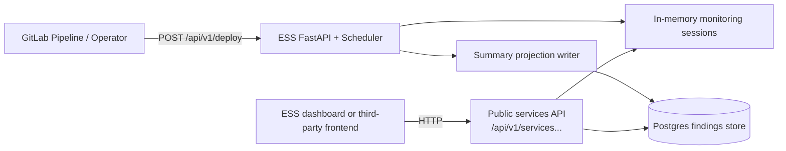

# ESS Services API and Findings Persistence



## Executive Summary

ESS needs a public, service-oriented read API that external dashboards can use without depending on internal `job_id` session identifiers. The right ownership boundary is to keep ESS as the canonical producer, persistence owner, and API owner, while keeping Bun + Hono as an optional consumer or BFF rather than the owner of ESS findings data. The recommended persistence backend is PostgreSQL, using an append-only observations table with a lightweight latest-summary projection because the data is structured, filterable, and naturally relational by service, environment, release, and severity. The first deliverable should ship fast: summary-only FastAPI endpoints for the latest deploy view per service, with no history, raw payloads, or debug data. Durable history, retention, and opt-in raw/debug surfaces should follow in later phases behind the same API seam.

## Technology Decisions

| Decision | Choice | Rationale |
|---|---|---|
| Canonical owner | ESS FastAPI remains the owner of findings persistence and public read APIs | Keeps domain ownership in the monitoring system itself and allows third-party frontends to depend on a stable ESS contract instead of an internal dashboard schema |
| Dashboard role | Bun + Hono remains an optional consumer/BFF only | Prevents Hono from becoming a second system of record and avoids direct database coupling in the presentation layer |
| Persistence backend | PostgreSQL | Best fit for service/environment/release/severity queries, 90-day retention, append-only writes, and structured JSON evidence using JSONB where needed |
| Data model shape | Append-only deploy observations plus a latest-summary projection | Supports quick MVP reads now and richer historical reads later without changing the public API namespace |
| Phase 1 ship target | Scheduler-backed latest-only services API with summary fields only | Delivers value quickly without blocking on persistence, while still establishing the public route structure that later phases preserve |

### Why PostgreSQL

PostgreSQL is the recommended persistence backend because ESS findings are structured operational records, not unbounded documents, wide-column telemetry streams, graph traversals, or vector-search content.

- PostgreSQL matches the dominant query shapes directly: latest deploy by service, deploy history by environment, release-specific lookup, retention-window scans, and severity filtering.
- JSONB is enough for structured findings arrays and evidence-link payloads without forcing a document database.
- ACID writes and predictable indexing are useful because ESS is producing canonical deploy findings that third-party consumers may depend on.

Why not the alternatives for this feature:

- MongoDB: document flexibility is not the hard part here; stable filtering, retention, and release-oriented querying matter more.
- Cassandra: optimized for very large write-heavy time-series shapes, but this feature needs richer filtered reads and simpler operational overhead.
- Graph databases: the dashboard and public API are not graph-traversal problems.
- Qdrant or Milvus: vector stores are not a fit for canonical deploy-history retrieval; semantic search can be added later as a separate concern if needed.

## Recommendation

Recommend a third path rather than either extreme listed in the dashboard design discussion.

### Recommended Path

1. Keep ESS and FastAPI as the canonical backend and public API owner.
2. Add persistence inside ESS, owned by ESS, using PostgreSQL.
3. Keep Bun + Hono separate and consume ESS over HTTP only; do not have Hono read the database directly.

Why this is the better path:

- It preserves ESS as the authoritative product surface for deploy findings.
- It supports third-party frontends cleanly because the public contract stays in ESS.
- It avoids duplicating retention, filtering, validation, and authorization logic across two backends.
- It keeps the dashboard stack decoupled from the persistence schema.
- It still keeps future room for a dedicated query service later, if the read load or product surface ever justifies it.

### Why Not Keep Everything In-Memory Inside ESS

- It is fine for the first latest-only ship, but it cannot satisfy the intended 90-day service exploration contract.
- Restarting ESS would wipe the grouped service history surface.
- Historical comparison by service, environment, and release needs durable storage.

### Why Not Let Bun + Hono Read The Database Directly

- It would make the database schema an implicit public contract.
- It would move domain ownership away from ESS even though ESS is the system generating the findings.
- It would force dashboard-specific logic to understand ESS monitoring semantics, retention rules, and payload flags.
- It makes third-party frontend support weaker because the clean reusable surface becomes the database or Hono, not ESS itself.

## Goal

Add a stable, service-oriented ESS API that:

- exposes human-facing service names for discovery
- exposes the latest deploy summary per service first
- grows into environment- and release-oriented history later
- preserves `GET /api/v1/deploy/{job_id}` as the operational session/debug endpoint during the transition
- keeps raw payloads and debug surfaces out of the initial public ship

## Directory Structure

Target additions:

```text
src/
├── api/
│   └── services.py
├── persistence/
│   ├── __init__.py
│   ├── service_findings_store.py
│   ├── postgres.py
│   └── migrations/
tests/
├── test_services_api.py
└── test_service_findings_store.py
```

Notes:

- `src/api/services.py` should hold the new APIRouter and keep `src/main.py` from absorbing all new route logic.
- `src/persistence/` should remain an internal ESS concern; no dashboard code should depend on it directly.
- Public response schemas should stay in `src/models.py` so FastAPI/OpenAPI remains the canonical contract surface.

## Phased Implementation

### Phase P1 — Latest-Only Services API

Objective: ship a minimal public API quickly, without waiting for durable persistence.

#### P1.1 Define summary-only public response models

- Add typed models in `src/models.py` for:
  - service discovery entries returned by `GET /api/v1/services`
  - service overview responses returned by `GET /api/v1/services/{service_name}`
  - latest deploy summaries with severity, timestamps, release info, environment, and structured findings
- Exclude raw payloads and debug payloads from these models entirely.
- Acceptance target: OpenAPI clearly distinguishes service-oriented responses from the existing `JobStatusResponse` session endpoint.

#### P1.2 Add a scheduler-backed latest-services read model

- Introduce a small read-model helper that projects the latest known service summary from current in-memory monitoring sessions.
- Do not read scheduler private fields from the route layer; add explicit scheduler accessors or a read helper boundary.
- Use human-facing `ServiceTarget.name` as the service key.
- Limit scope to latest-only summaries; no 90-day guarantee yet.
- Acceptance target: service discovery and service overview can be built entirely from current runtime state.

#### P1.3 Expose the first public services endpoints

- Add `GET /api/v1/services`.
- Add `GET /api/v1/services/{service_name}`.
- Preserve `GET /api/v1/deploy/{job_id}` and document it as the session/debug endpoint.
- Keep responses summary-only.
- Acceptance target: a third-party frontend can list services and fetch the latest deploy summary for one service without using `job_id`.

#### P1.4 Add tests for service discovery and latest-only views

- Add route tests for service discovery, latest-only service lookup, not-found behavior, and stable response shape.
- Verify no raw/debug fields appear in the response.
- Acceptance target: targeted pytest coverage for the new public routes passes.

#### P1.5 Documentation update for MVP semantics

- Update `docs/designs/dashboard-architecture.md`, `docs/context/WORKFLOWS.md`, and `docs/README.md` to record that Phase 1 ships latest-only service summaries backed by in-memory state.
- Explicitly document that historical retention and 90-day service exploration are not available until persistence lands.
- Acceptance target: docs reflect the temporary in-memory limitation without changing the long-term API direction.

### Phase P2 — Persistence Foundation

Objective: add durable storage and a stable 90-day latest-summary surface while keeping the Phase 1 API intact.

#### P2.1 Add ESS-owned Postgres configuration and bounded async settings

- Add typed Postgres settings in `src/config.py` for DSN, pool sizing, statement timeout, and persistence enablement.
- Keep all environment access routed through `ESSConfig`.
- Acceptance target: persistence configuration is available without raw environment access in application code.

#### P2.2 Introduce a `ServiceFindingsStore` abstraction

- Add a store interface that the routes and completion callbacks can depend on.
- Keep the public API independent from whether the backing store is scheduler-backed or Postgres-backed.
- Acceptance target: Phase 1 routes can be refactored behind the store boundary without changing their response contract.

#### P2.3 Create the append-only observations schema and latest projection

- Add a Postgres schema centered on an append-only service deploy observations table keyed by service name, environment, release version, and monitoring session identifiers.
- Store structured findings and evidence links in summary form; use JSONB where structured evidence does not deserve its own table.
- Add a latest-summary projection or equivalent query strategy so `GET /api/v1/services*` does not have to scan raw history on every request.
- Add 90-day retention as the default policy.
- Acceptance target: the schema can answer service discovery and latest-summary queries for the last 90 days.

#### P2.4 Persist summary-only findings without breaking monitoring

- Persist summary-only observations from the monitoring completion path.
- Bound all persistence I/O with timeouts.
- Treat persistence failures as non-fatal to the monitoring loop: log them, emit metrics, and continue monitoring.
- Acceptance target: ESS remains observer-only and resilient even if Postgres is temporarily unavailable.

#### P2.5 Switch public services endpoints to repository-backed reads

- Move `GET /api/v1/services` and `GET /api/v1/services/{service_name}` from scheduler-only reads to the persistent store.
- Preserve the Phase 1 route shapes.
- Where feasible, overlay live in-memory sessions so currently running deploys still appear immediately.
- Acceptance target: latest-only service views survive process restarts and cover the default 90-day window.

#### P2.6 Add persistence tests and docs

- Add unit tests for repository behavior and route tests for persisted reads.
- Add at least one integration path for Postgres-backed persistence, gated appropriately if real infrastructure is required.
- Update docs and `.env.example`.
- Acceptance target: the persistence seam is tested and documented well enough for implementation work to proceed safely.

### Phase P3 — Service History API

Objective: extend the public contract from latest-only summaries to durable service history.

#### P3.1 Expose environment-scoped deploy history

- Add `GET /api/v1/services/{service_name}/environments/{environment}/deploys`.
- Support `latest_only`, `limit`, and `severity` query parameters.
- Keep `latest_only=true` list-shaped so the response schema remains stable.
- Acceptance target: external consumers can retrieve recent deploy history for one service in one environment with consistent list semantics.

#### P3.2 Expose release-specific drilldown

- Add `GET /api/v1/services/{service_name}/environments/{environment}/deploys/{release_version}`.
- Keep this release-oriented endpoint summary-first: structured findings and evidence links only.
- Acceptance target: external consumers can bookmark or compare a specific release view without knowing ESS session IDs.

#### P3.3 Preserve clear resource boundaries

- Keep `GET /api/v1/deploy/{job_id}` operational and session-oriented.
- Keep `/api/v1/services...` public and service-oriented.
- Do not overload the deploy-session endpoint or path namespace with service-history behavior.
- Acceptance target: the API remains semantically unambiguous for operators and external frontend builders.

#### P3.4 Add tests and documentation for history semantics

- Add coverage for severity filtering, list ordering, retention-window behavior, and latest-only query semantics.
- Update docs to explain the difference between session APIs and service-history APIs.
- Acceptance target: the service-history surface is documented as the long-term standard read API.

### Phase P4 — Raw/Debug Expansion And Review Gate

Objective: add deeper payload access only after the summary and history surfaces are stable.

#### P4.1 Add `include_raw` and `include_debug` separately

- Keep `include_raw` and `include_debug` as distinct query flags.
- Fetch expensive or sensitive fields only when explicitly requested.
- Apply payload-size and performance guardrails so the public endpoints remain cheap by default.
- Acceptance target: default reads remain fast and safe, while advanced consumers can opt into deeper data intentionally.

#### P4.2 Document third-party frontend guidance and endpoint posture

- Document which endpoints are intended for dashboards and third-party consumers.
- Document whether and when `GET /api/v1/deploy/{job_id}` may be deprecated from the public contract, while preserving it operationally as long as needed.
- Acceptance target: frontend builders know which ESS routes are stable and intended for external consumption.

#### P4.3 Run `review-plan-phase` audit

- Run the required plan-vs-implementation audit before closing the effort.
- Acceptance target: implementation is not marked complete without the repo’s required review gate.

## Open Questions

- None at plan time. The architecture decision is to keep ESS as the canonical API and persistence owner, ship latest-only service endpoints first, and defer history plus raw/debug depth to later phases.